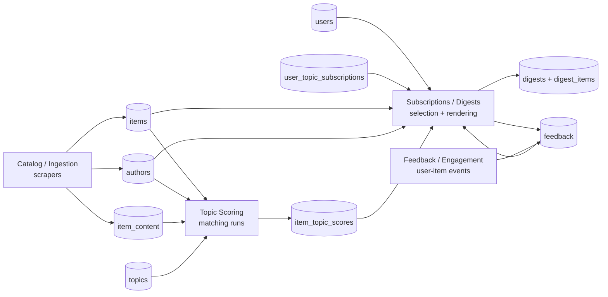
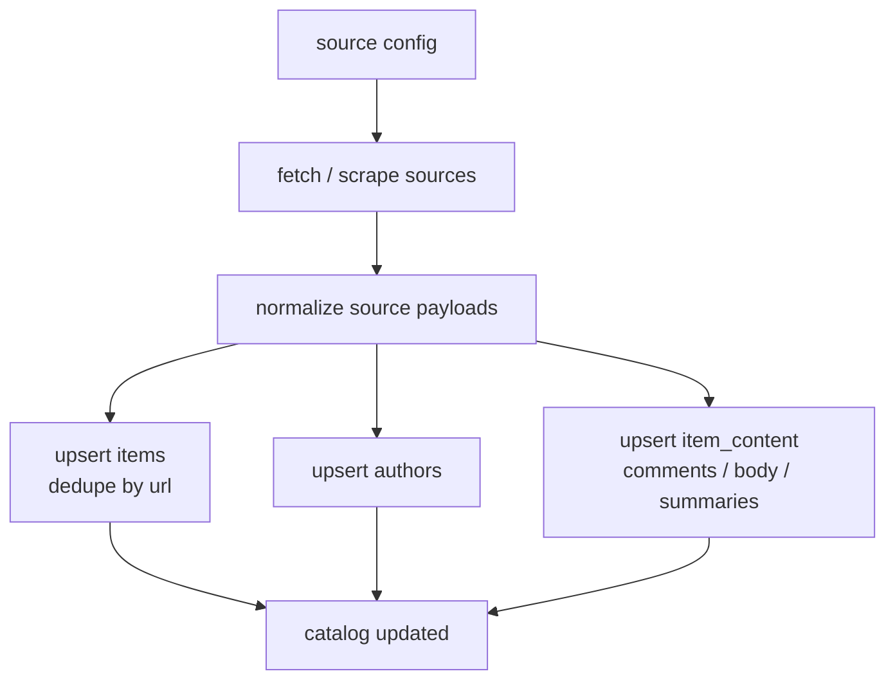
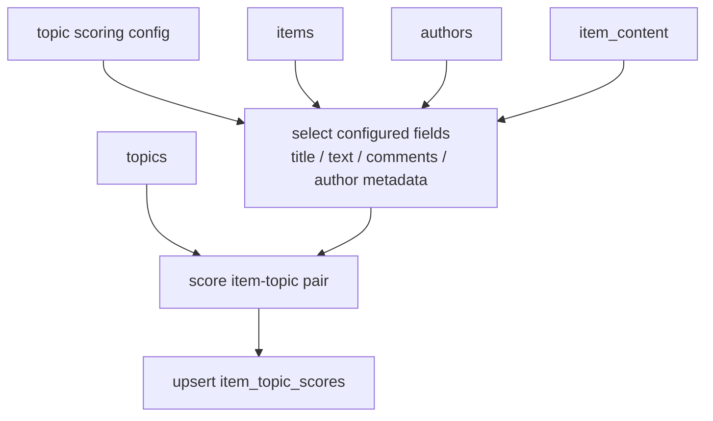
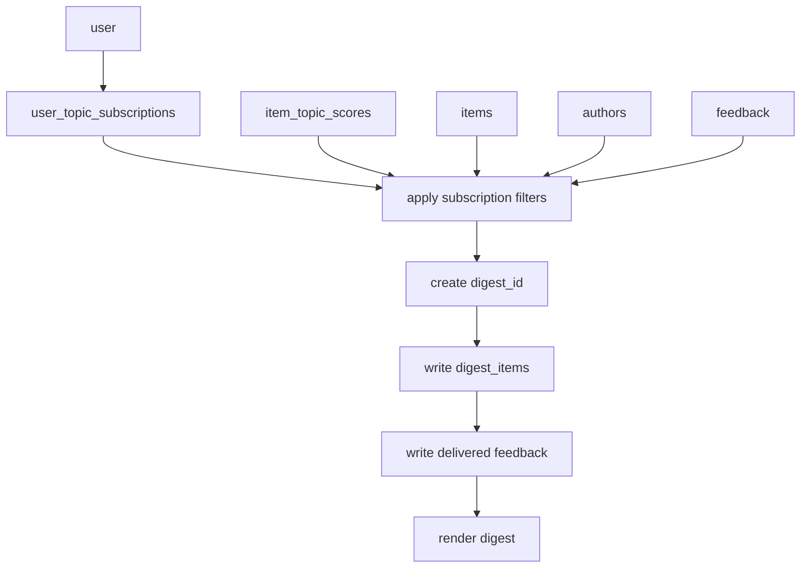
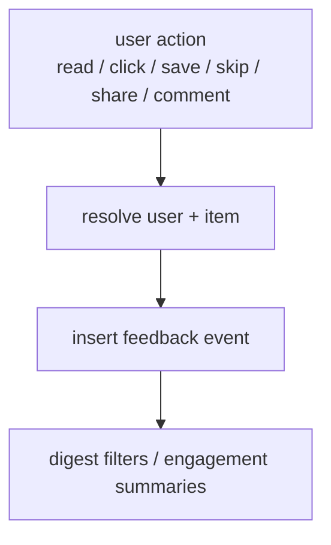
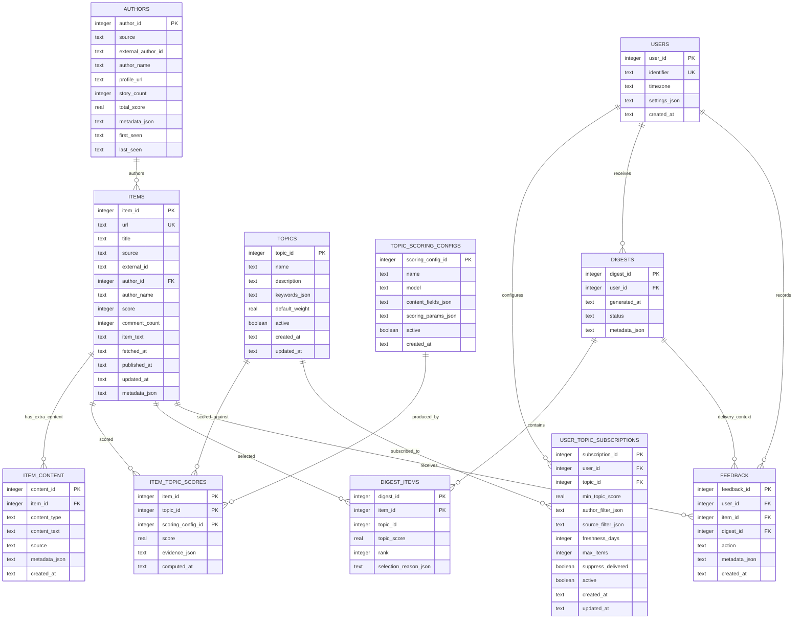

# knowledge-os - Architecture

## Overview

`knowledge-os` is a local knowledge briefing system built around four independent modules:

1. **Catalog/Ingestion** - scrapers update static content tables.
2. **Topic Scoring** - configurable scoring calculates item-topic matches.
3. **Subscriptions/Digests** - users subscribe to scored topics through filters; digest generation reads precomputed data.
4. **Feedback/Engagement** - user-per-item events are recorded centrally.

Language ownership:

- **Scala** owns high-throughput concurrent ingestion and digest selection/ranking.
- **Python** owns ML topic scoring, scoring customizability, feedback parsing, and flexible rendering/analysis.
- Cross-language integration happens through SQLite tables, not direct runtime calls.

The key architectural rule is separation of runs:

- Running a scraper updates `items` and `authors`; it does not score topics or generate digests.
- Running topic scoring updates `item_topic_scores`; it does not scrape or generate digests.
- Running digest generation creates a new `digest_id`; it does not scrape or score.
- Recording feedback writes user/item events; it does not mutate catalog or scoring outputs.

Current code still combines several of these concerns inside the digest path. This document describes the target architecture to migrate toward, even where it differs from the current implementation.

## Module Boundaries



### Catalog / Ingestion

Owns static content and author state.

Inputs:

- Source configuration: Hacker News, Substack, and future sources.
- Raw source payloads from fetchers/scrapers.

Outputs:

- `items`: canonical content rows deduped by `items.url`.
- `authors`: static or cached author metadata and aggregate source-level stats.
- `item_content`: separate content fragments such as comments, extracted body text, summaries, and source-specific annotations.

Rules:

- `items.url` is the dedupe key for content identity.
- Scrapers may update item metadata such as title, score, source, author, `published_at`, `fetched_at`, `external_id`, and raw text fields.
- Extra content such as comments is stored separately in `item_content`; it is not folded permanently into the canonical item row.
- Scraper runs do not read user subscriptions and do not create digests.
- Author updates are catalog concerns, not digest concerns.

### Topic Scoring

Owns the configurable logic that turns topics and catalog items into scores.

Inputs:

- `items`
- `authors`
- `topics`
- topic scoring configuration

Outputs:

- `item_topic_scores`
- optional scoring-run metadata for auditability and recomputation

Rules:

- Topics are configurable definitions, not user subscriptions.
- Every score is tied to an item, a topic, and the scoring configuration used.
- Historical scores are retained by `scoring_config_id`; a new scoring config writes a new score set instead of replacing older configs.
- Scoring configuration decides which content fields participate: title, URL text, item body, comments, author metadata, source metadata, or future embeddings.
- Scoring can be triggered by new items, topic changes, scoring-config changes, or manual recomputation.
- Digest generation must never trigger topic scoring implicitly.

### Subscriptions / Digests

Owns user-specific selection from already-scored content.

Inputs:

- `users`
- `user_topic_subscriptions`
- `items`
- `authors`
- `topics`
- `item_topic_scores`
- `feedback`

Outputs:

- `digests`
- `digest_items`
- `feedback` rows for delivery events

Rules:

- A user subscribes to topics through filter configuration.
- Subscription filters can include topic score threshold, author allow/deny lists, source filters, freshness windows, maximum items, already-delivered suppression, and digest cadence.
- Each `generate_digest` run creates a new `digest_id`.
- Digest generation only reads catalog/scoring data; it does not scrape and does not score.
- Digest membership is explicit in `digest_items`; do not rely only on JSON item lists.
- Scala owns selection and ranking only. Markdown rendering can remain Python-owned.

### Feedback / Engagement

Owns user-per-item event tracking.

Inputs:

- Digest delivery events.
- Read tracking.
- Click/save/skip/share actions.
- Engagement outcomes such as comments or replies.

Outputs:

- `feedback` event rows.
- optional engagement summary tables or views.

Rules:

- Feedback is scoped to `(user_id, item_id, action, created_at)`.
- Feedback can be used by digest selection as an input, but it does not belong to ingestion or topic scoring.
- Engagement-specific tables can exist, but they should produce or consume common feedback events instead of becoming a parallel feedback model.

## Data Lifecycle

### Scraper Run



### Topic Scoring Run



### Digest Run



### Feedback Sync



## Target Storage Schema



### Schema Notes

- `items` and `authors` are catalog tables. They are not user-specific.
- `topics` are global scoring definitions. User preference lives in `user_topic_subscriptions`.
- `topic_scoring_configs.content_fields_json` defines whether scoring uses only title or includes item text, `item_content` rows such as comments, author metadata, source metadata, or other extracted fields.
- `item_topic_scores` is a computed table. Historical scores are retained by `(item_id, topic_id, scoring_config_id)`, and it should be safe to delete/recompute one scoring config at a time.
- `digests` is the digest run header. `digest_items` is the immutable membership list for that run.
- `feedback` is the common event log for delivery, reading, clicks, saves, skips, shares, and engagement outcomes.

## Configuration Model

Configuration should be split by module so a digest run does not need scraper or scoring decisions.

### Source Config

Controls only ingestion.

```json
{
  "sources": {
    "hackernews": {
      "enabled": true,
      "min_score": 50,
      "max_items": 90,
      "concurrency": 6,
      "throttle_ms": 250,
      "request_timeout_ms": 15000,
      "retries": 2
    },
    "substack": {
      "enabled": true,
      "feeds": ["https://example.substack.com/feed"],
      "max_items_per_feed": 10
    }
  }
}
```

### Topic Scoring Config

Controls scoring logic and content inputs.

```json
{
  "topic_scoring": {
    "config_name": "title_author_comments_v1",
    "model": "all-MiniLM-L6-v2",
    "content_fields": ["title", "item_text", "comment_summary", "author_metadata"],
    "similarity_threshold": 0.3
  },
  "topics": [
    {
      "name": "AI/ML/LLMs",
      "keywords": ["large language models", "agents", "evals"],
      "default_weight": 1.0
    }
  ]
}
```

### User Subscription Config

Controls digest selection.

```json
{
  "user": {
    "identifier": "vb",
    "timezone": "Asia/Calcutta"
  },
  "subscriptions": [
    {
      "topic": "AI/ML/LLMs",
      "min_topic_score": 0.35,
      "freshness_days": 7,
      "sources": ["hackernews", "substack"],
      "authors": { "allow": [], "deny": [] },
      "max_items": 8,
      "suppress_delivered": true
    }
  ],
  "digest": {
    "cadence": "daily",
    "max_items": 20,
    "format": "markdown"
  }
}
```

### Feedback Config

Controls event ingestion and engagement summaries.

```json
{
  "feedback": {
    "read_tracking": true,
    "click_tracking": false,
    "engagement_sources": ["hn_comments"],
    "actions": ["delivered", "read", "read_with_note", "clicked", "saved", "skipped", "shared", "commented"]
  }
}
```

## Target Runtime Commands

These commands express the intended separation:

```bash
# Ingestion only
sbt "runMain knowledgeos.Ingest --db knowledge_os.db --sources config/sources.json"

# Scoring only
python -m knowledge_os.topic_scoring --db knowledge_os.db --config config/topic_scoring.json

# Persona/subscription materialization only
python -m knowledge_os.personas --db knowledge_os.db --catalog personas/catalog.json --user-config configs/users/vb.json

# Digest selection/ranking + rendering only
sbt "runMain knowledgeos.GenerateDigest --db knowledge_os.db --user vb --max-items 20"
python -m knowledge_os.render_digest --db knowledge_os.db --user vb --digest-id 1

# Feedback sync only
python -m knowledge_os.feedback_events --db knowledge_os.db --user vb --source knos-digest/vb/YYYY-MM-DD.md
```

## Implementation Status

Implemented in this branch:

- Target schema initializer: `python -m knowledge_os.schema --db knowledge_os.db`.
- Python topic scoring command: `python -m knowledge_os.topic_scoring --db knowledge_os.db --config config/topic_scoring.example.json`.
- Python persona materializer: `python -m knowledge_os.personas --db knowledge_os.db --catalog personas/catalog.json --user-config configs/users/vb.json`.
- Python feedback event sync: `python -m knowledge_os.feedback_events --db knowledge_os.db --user vb --source knos-digest/vb/YYYY-MM-DD.md`.
- Python digest renderer: `python -m knowledge_os.render_digest --db knowledge_os.db --user vb --digest-id 1`.
- Scala catalog ingestion entry point: `sbt "runMain knowledgeos.Ingest --db knowledge_os.db --sources config/sources.example.json"`.
- Scala digest selection/ranking entry point: `sbt "runMain knowledgeos.GenerateDigest --db knowledge_os.db --user vb --max-items 20"`.
- Modular runner: `bash scripts/run_modular_digest.sh --db knowledge_os.db --user vb --overwrite`.
- User runner: `bash scripts/run_user_digest.sh --user kintu --overwrite`.
- All-user runner: `bash scripts/run_all_users.sh --overwrite`.
- Scala unit tests for item URL dedupe, author upsert, subscription filtering, digest membership writes, and delivered feedback.
- Scala integration test for the catalog -> scoring -> subscription -> digest -> feedback flow over the target schema.

Verification commands:

```bash
scala -version
sbt test
venv/bin/python -m pytest tests/test_target_schema.py -q
venv/bin/python -m pytest tests/ -q -m "not integration"
```

Operational query scripts:

```bash
bash scripts/query_catalog.sh
bash scripts/query_scoring.sh
bash scripts/query_subscriptions.sh --user vb
bash scripts/query_digest.sh
bash scripts/query_digest.sh --digest-id 1
bash scripts/query_feedback.sh --user vb
bash scripts/query_catalog.sh --since 2026-05-14 --until 2026-05-14
bash scripts/query_scoring.sh --topic AI/ML/LLMs --since 2026-05-14
```

## Migration Notes

Current implementation gaps relative to this architecture:

- `scripts/run_digest_v2.sh` still fetches, merges, processes, scores, stores, renders, and archives in one legacy production path.
- Legacy `digest_pipeline.py` still persists items and item-topic scores during digest generation; the new `GenerateDigest` path only reads precomputed scores and writes digest membership plus delivered feedback.
- Legacy storage still has older topic/digest shapes; the target schema moves persona/user preference to subscriptions and stores digest membership in `digest_items`.
- Legacy rendering still sits in the old production path, but the modular renderer now consumes `digest_items`.
- Engagement-specific summaries can remain, but event ingestion should converge on the common `feedback` table.

Recommended migration order:

1. Expand `scripts/run_modular_digest.sh` from a local runner into the daily production runner.
2. Bring the modular renderer to feature parity with the legacy formatter where needed.
3. Move HN/Substack fetchers behind the Scala ingestion command, keeping source-specific extraction isolated.
4. Expand `item_content` population for comments, extracted bodies, summaries, and source annotations.
5. Retire legacy topic/digest writes once the modular path produces the daily digest end to end.
6. Normalize engagement summaries to read/write common `feedback` events.
