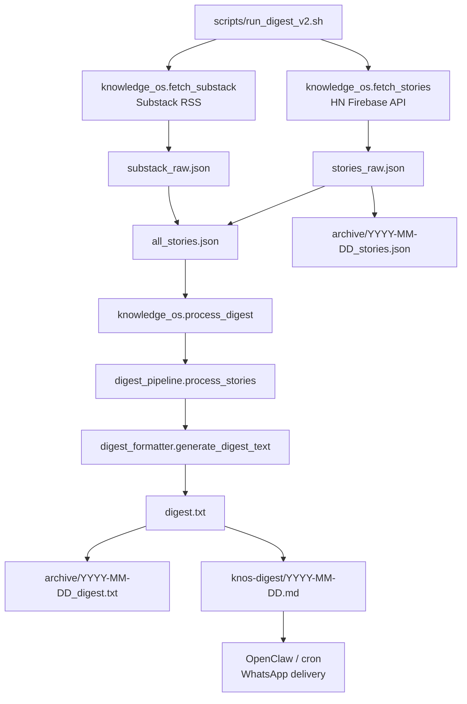
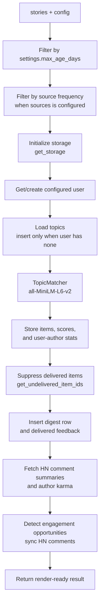
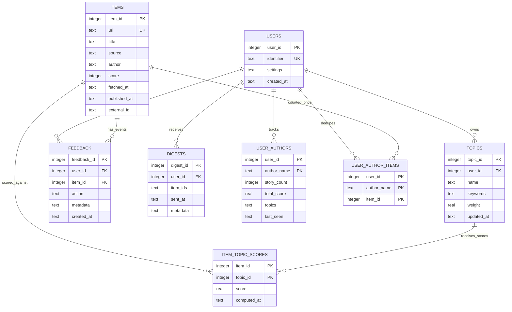
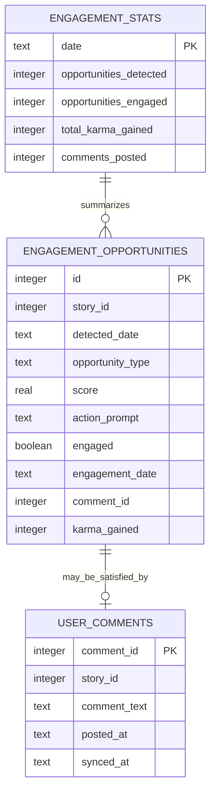

# knowledge-os - Architecture

## Overview

`knowledge-os` is a local digest pipeline that fetches stories from Hacker News and optional Substack RSS feeds, filters them against an explicit interest profile, stores continuity data in SQLite, and writes a daily markdown digest.

Current implementation:

- One active runtime config: `config.json`.
- One active SQLite backend: `hn_digest_v2.db` by default.
- One digest artifact per date: `knos-digest/YYYY-MM-DD.md`.
- A storage schema that is partially multi-user-ready: users, topics, feedback, digests, and user-author stats all carry `user_id`.
- Pipeline entrypoint: `scripts/run_digest_v2.sh`.

Not implemented yet:

- Persona catalog and persona-resolved user configs.
- Per-user runner/output directories.
- Postgres backend.
- External-user dashboard or link tracking.

## Core Principles

1. **Explicit interests** - Topics and keywords come from config, not inferred behavior.
2. **Daily cadence** - The system optimizes for a quiet daily briefing, not a real-time feed.
3. **Storage abstraction** - Runtime code uses `StorageInterface`; SQLite is the only implemented backend today.
4. **Event log feedback** - Delivery/read actions are recorded as feedback events.
5. **Local-first operation** - Generated files, SQLite, dashboard, and scripts are designed for local cron/OpenClaw workflows.

## Runtime Flow



### Fetch

- `src/knowledge_os/fetch_stories.py` fetches top Hacker News stories through the Firebase API.
- `src/knowledge_os/fetch_substack.py` fetches configured Substack RSS feeds when `sources.substack.enabled` is present and true.
- Both fetchers normalize into the shared story shape: `id`, `title`, `url`, `score`, `by`, `time`, `descendants`, `text`, `source`, `fetched_at`, and `published_at`.

### Process

`src/knowledge_os/process_digest.py` loads `config.json`, reads `all_stories.json`, calls `digest_pipeline.process_stories`, then renders markdown with `digest_formatter.generate_digest_text`.

`src/knowledge_os/digest_pipeline.py` performs the main orchestration:



The important current limitation is topic sync: configured topics are inserted only when the user has no topics yet, so later config edits do not reliably update existing topic rows.

### Render And Deliver

- Weekday digest output is grouped by matched topic.
- Weekend mode, when enabled, renders “Best Matches” and “Interesting Reads”.
- Each story has an inline checkbox and `Notes:` line for read tracking.
- Python does not send WhatsApp directly. OpenClaw/cron consumes the generated output.

### Post-Delivery Tools

- `sync_reading_log.py` parses checked markdown items and writes `read` or `read_with_note` feedback.
- `engagement_summary.py` summarizes recent engagement data for the local HN user.
- `weekly_summary.py` summarizes matched stories from the last seven days.
- `dashboard.py` runs a local Streamlit dashboard against `hn_digest_v2.db` and `config.json`.

## Configuration

The active runtime path is still a single `config.json`. `config.example.json` documents the minimum shape:

```json
{
  "storage": {
    "backend": "sqlite",
    "sqlite": { "db_path": "hn_digest_v2.db" },
    "postgres": {
      "host": "localhost",
      "port": 5432,
      "database": "hn_digest",
      "user": "postgres",
      "password": ""
    }
  },
  "user": {
    "identifier": "+910000000000",
    "timezone": "Asia/Calcutta"
  },
  "topics": [
    {
      "name": "AI/ML/LLMs",
      "keywords": ["artificial intelligence", "machine learning"],
      "weight": 1.0
    }
  ],
  "settings": {
    "max_stories": 30,
    "min_score": 50,
    "similarity_threshold": 0.3,
    "digest_time": "14:00",
    "track_authors": true,
    "track_continuity": true,
    "notable_author_threshold": 3
  }
}
```

The code also supports an optional `sources` section used by Substack and source-frequency filtering:

```json
{
  "sources": {
    "hackernews": { "enabled": true, "frequency": "daily" },
    "substack": {
      "enabled": true,
      "frequency": "daily",
      "feeds": [
        "https://example.substack.com/feed",
        { "url": "https://weekly.example.com/feed", "frequency": "weekly" }
      ],
      "max_items": 10
    }
  }
}
```

`sources` is not present in the current `config.example.json`, so new installs that need Substack should add it explicitly.

## Storage Schema

SQLite schema lives in `src/knowledge_os/storage_sqlite.py`. The storage interface lives in `src/knowledge_os/storage_interface.py`.



Core storage notes:

- `items.url` is globally unique. Re-fetching a URL with a newer `published_at` updates the row and can re-surface it.
- `topics` are user-scoped and unique by `(user_id, name)`.
- `item_topic_scores` records semantic similarity for each stored item/topic pair.
- `feedback` is the event log for `delivered`, `read`, `read_with_note`, and future actions.
- `digests.item_ids` stores the delivered item list as JSON text.
- `authors` still exists as an older global table. Current author continuity uses `user_authors` and `user_author_items`.

### Engagement Schema

`src/knowledge_os/engagement.py` owns engagement-specific tables. They are intentionally separate from the storage interface today.



## Storage Interface

Current interface responsibilities:

```python
storage = get_storage(
    backend=config["storage"]["backend"],
    **config["storage"][config["storage"]["backend"]]
)
```

- `sqlite` is implemented by `SQLiteStorage`.
- `postgres` is referenced by the factory but `storage_postgres.py` is not implemented.
- `insert_item` returns `(item_id, is_new)`. The pipeline now uses delivered-feedback gating for display, not `is_new`.
- `get_undelivered_item_ids(item_ids)` currently checks delivery globally across all users. This is acceptable for today's single active config, but must become user-scoped before real multi-user runs.

## Current Operational Commands

```bash
# Run unit tests
venv/bin/python -m pytest tests/ -v -m "not integration"

# Run all tests, including integration tests
venv/bin/python -m pytest tests/ -v

# Generate today's digest
bash scripts/run_digest_v2.sh

# Fetch and store only
bash scripts/run_digest_v2.sh --fetch-only

# Re-run today's digest after clearing generated artifacts and stale delivered feedback
bash scripts/run_digest_v2.sh --rerun

# Generate and push today's digest markdown
bash scripts/run_digest_v2.sh --push

# Sync checked read items from a digest file
venv/bin/python -m knowledge_os.sync_reading_log knos-digest/YYYY-MM-DD.md

# Run local dashboard
venv/bin/python -m streamlit run src/knowledge_os/dashboard.py
```

## Known Architecture Gaps

- **Persona model:** PM docs define persona IDs and canonical topic bundles, but no `personas/` catalog or resolver exists yet.
- **Multi-user config:** Runtime still assumes one `config.json`; there is no `configs/users/` loader or `--user` CLI.
- **Per-user outputs:** Runner writes to date-only archive and digest paths, so Kintu/Mikey/VB outputs would collide.
- **Per-user storage:** Schema has `user_id`, but the active DB path is global and `get_undelivered_item_ids` is not user-scoped.
- **Topic sync:** Topics are inserted only when a user has none. Config changes do not reliably update existing topic rows.
- **Dashboard and summaries:** Dashboard, weekly summary, engagement summary, and reading-log sync all default to `hn_digest_v2.db` / `config.json`.
- **Postgres:** Mentioned in config and factory, but no backend implementation exists.

## Next Architecture Direction

The next planned architecture change is persona-driven multi-user SQLite:

- Add a canonical persona catalog.
- Add base and per-user config files.
- Resolve personas plus `personal_topics` into the existing topic shape at runtime.
- Generate isolated DBs and digest markdown files per user.
- Make delivery suppression user-scoped.
- Keep delivery as GitHub markdown URLs shared over WhatsApp until external-user behavior justifies more infrastructure.
