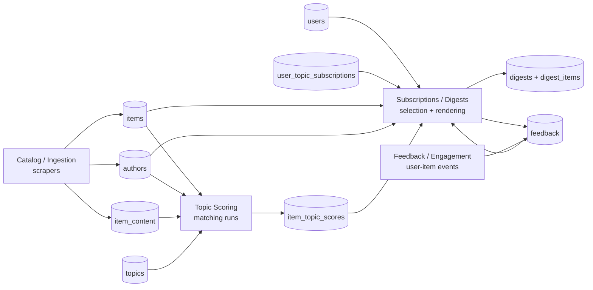
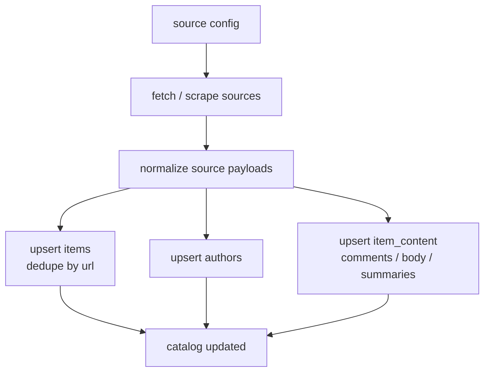
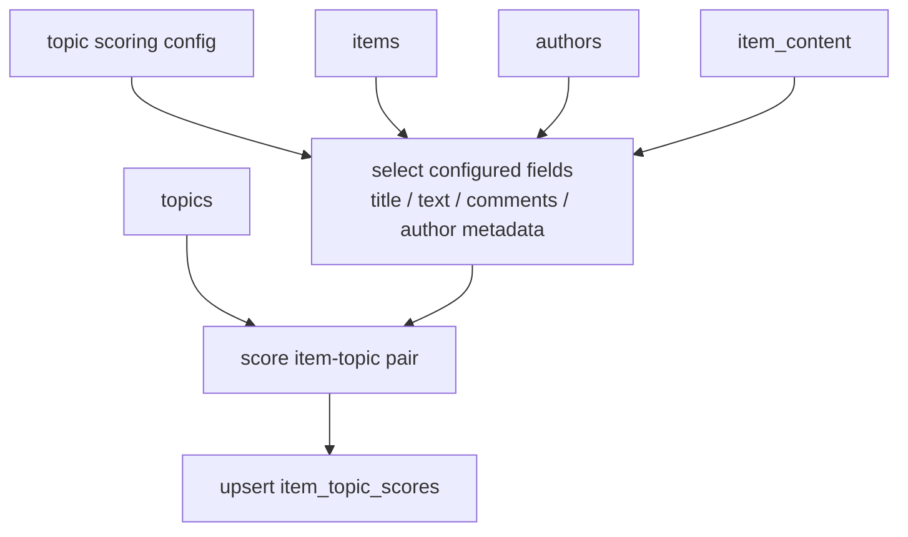
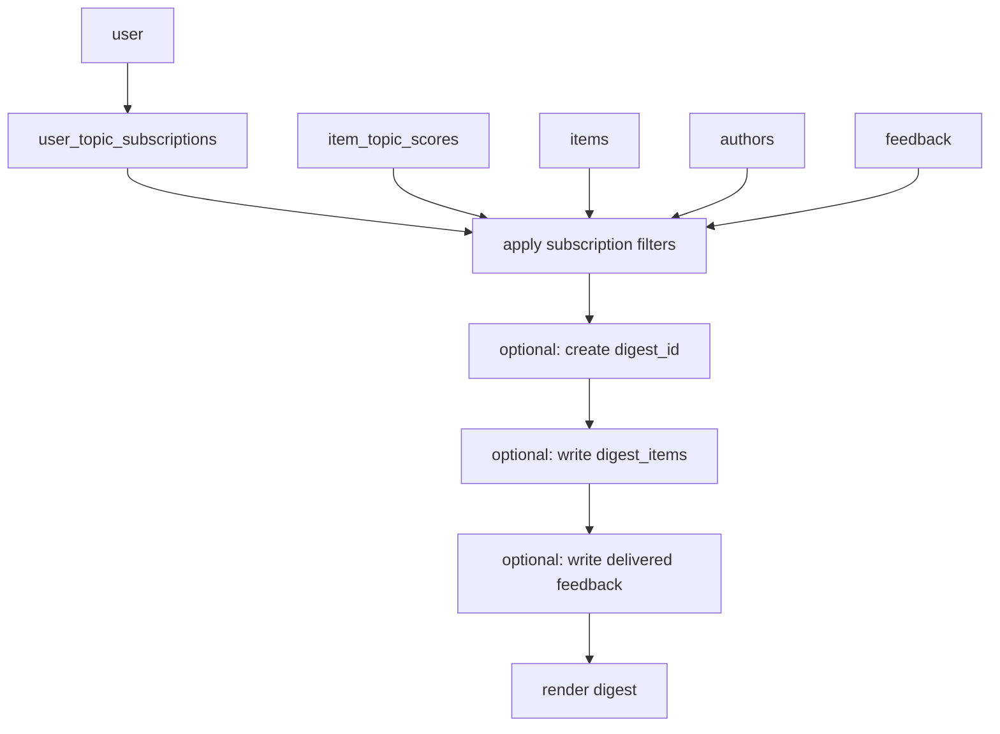
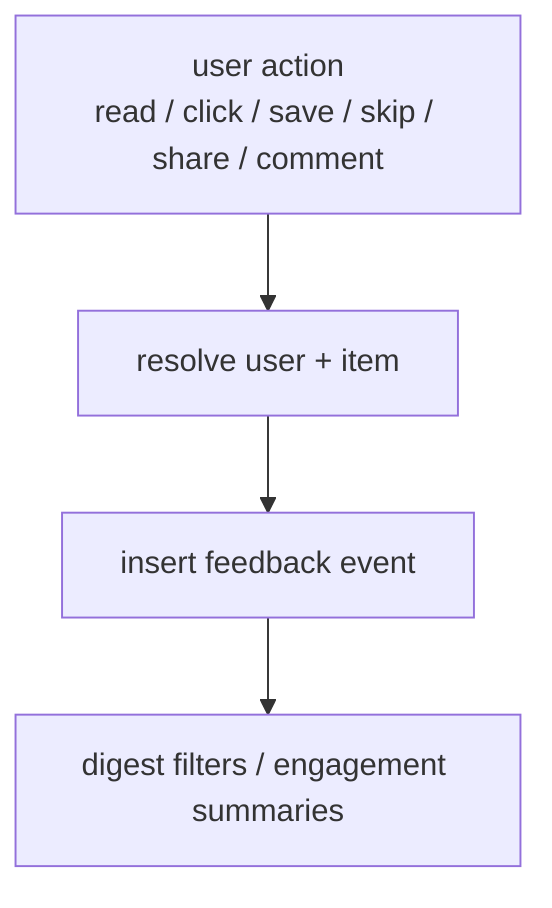
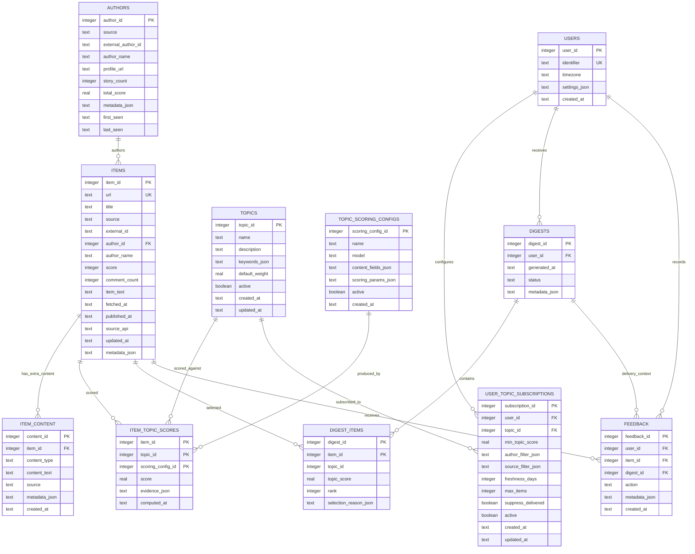

# knowledge-os - Architecture

## Overview

`knowledge-os` is a local knowledge briefing system built around four independent modules:

1. **Catalog/Ingestion** - scrapers update static content tables.
2. **Topic Scoring** - configurable scoring calculates item-topic matches.
3. **Subscriptions/Digests** - users subscribe to scored topics through filters; digest generation reads precomputed data.
4. **Feedback/Engagement** - user-per-item events are recorded centrally.

Language ownership:

- **Scala** owns high-throughput concurrent catalog ingestion.
- **Python** owns ML topic scoring, persona materialization, persona-aware selection/rendering, feedback parsing, and operational analysis.
- Cross-language integration happens through SQLite tables, not direct runtime calls.

The key architectural rule is separation of runs:

- Running a scraper updates `items` and `authors`; it does not score topics or generate digests.
- Running topic scoring updates `item_topic_scores`; it does not scrape or generate digests.
- Running digest generation selects/renders from already-scored rows; it does not scrape or score. DB-backed digest persistence can also create `digests`/`digest_items`.
- Recording feedback writes user/item events; it does not mutate catalog or scoring outputs.

The modular path follows this separation. `scripts/run_modular_digest.sh` is an orchestration wrapper that runs the module commands in order; the individual modules still communicate only through SQLite. The older `scripts/run_digest_v2.sh` path remains for compatibility/comparison and still combines several concerns.

## Module Boundaries



### Catalog / Ingestion

Owns static content and author state.

Inputs:

- Source configuration: Hacker News, Substack, and future sources.
- Raw source payloads from fetchers/scrapers.

Outputs:

- `items`: canonical content rows deduped by `items.url`.
- `authors`: static or cached author metadata and aggregate source-level stats.
- `item_content`: separate content fragments such as comments, extracted body text, summaries, and source-specific annotations.

Rules:

- `items.url` is the dedupe key for content identity.
- Scrapers may update item metadata such as title, score, source, author, `published_at`, `fetched_at`, `external_id`, and raw text fields.
- `published_at` is the source-native publication/submission timestamp. For HN this is the HN item timestamp; for RSS/Substack it is the feed entry timestamp.
- `fetched_at` is the logical catalog snapshot date. Normal current runs set it from `--date`; historical/audit runs should pass the source snapshot date being reconstructed, not wall-clock run time.
- `source_api` records the concrete ingestion provider, currently `hackernews_firebase`, `hackernews_algolia`, or `rss`.
- Extra content such as comments is stored separately in `item_content`; it is not folded permanently into the canonical item row.
- Scraper runs do not read user subscriptions and do not create digests.
- Author updates are catalog concerns, not digest concerns.

### Topic Scoring

Owns the configurable logic that turns topics and catalog items into scores.

Inputs:

- `items`
- `authors`
- `topics`
- topic scoring configuration

Outputs:

- `item_topic_scores`
- optional scoring-run metadata for auditability and recomputation

Rules:

- Topics are configurable definitions, not user subscriptions.
- Every score is tied to an item, a topic, and the scoring configuration used.
- Historical scores are retained by `scoring_config_id`; a new scoring config writes a new score set instead of replacing older configs.
- Scoring configuration decides which content fields participate: title, URL text, item body, comments, author metadata, source metadata, or future embeddings.
- Scoring can be triggered by new items, topic changes, scoring-config changes, or manual recomputation.
- Digest generation must never trigger topic scoring implicitly.

### Subscriptions / Digests

Owns user-specific selection from already-scored content.

Inputs:

- `users`
- `user_topic_subscriptions`
- `items`
- `authors`
- `topics`
- `item_topic_scores`
- `feedback`

Outputs:

- `knos-digest/YYYY-MM-DD.md`
- optional `digests`
- optional `digest_items`
- optional `feedback` rows for delivery events

Rules:

- A user subscribes to topics through filter configuration.
- Persona selection filters can include topic score threshold, source filters, maximum items, and cadence.
- Current canonical persona cadence is source-aware and stateless. Hacker News uses `items.fetched_at`; Substack/RSS uses `items.published_at`.
- Daily personas select the one-day cadence window ending on the digest date. Weekly personas select the inclusive seven-day window ending on the digest date. Optional `send_days` gates whether a persona contributes on a given weekday.
- When an item scores for multiple personas, canonical rendering assigns it to the strongest eligible persona so the shared markdown avoids repeated entries across persona sections.
- `freshness_days` remains in subscription storage for compatibility with older paths, but canonical persona rendering is cadence-driven.
- DB-backed digest runs should create a new `digest_id`. The current canonical markdown renderer renders `knos-digest/YYYY-MM-DD.md` directly from scored rows and does not yet persist `digests`/`digest_items`.
- Digest generation only reads catalog/scoring data; it does not scrape and does not score.
- When digest membership is persisted, `digest_items` is the explicit membership list; do not rely only on JSON item lists.
- Python currently owns persona selection, ranking, and markdown rendering.

### Feedback / Engagement

Owns user-per-item event tracking.

Inputs:

- Digest delivery events.
- Read tracking.
- Click/save/skip/share actions.
- Engagement outcomes such as comments or replies.

Outputs:

- `feedback` event rows.
- optional engagement summary tables or views.

Rules:

- Feedback is scoped to `(user_id, item_id, action, created_at)`.
- Feedback can be used by digest selection as an input, but it does not belong to ingestion or topic scoring.
- Engagement-specific tables can exist, but they should produce or consume common feedback events instead of becoming a parallel feedback model.

## Data Lifecycle

### Scraper Run



### Topic Scoring Run



### Digest Run



### Feedback Sync



## Storage Schema



### Schema Notes

- `items` and `authors` are catalog tables. They are not user-specific.
- `items.published_at` stores the source-native publication/submission timestamp; `items.fetched_at` stores the logical catalog snapshot date used for HN cadence; `items.source_api` stores the concrete ingestion provider.
- `topics` are global scoring definitions. User preference lives in `user_topic_subscriptions`.
- `topic_scoring_configs.content_fields_json` defines whether scoring uses only title or includes item text, `item_content` rows such as comments, author metadata, source metadata, or other extracted fields.
- `item_topic_scores` is a computed table. Historical scores are retained by `(item_id, topic_id, scoring_config_id)`, and it should be safe to delete/recompute one scoring config at a time.
- `digests` is the digest run header. `digest_items` is the immutable membership list for that run.
- `feedback` is the common event log for delivery, reading, clicks, saves, skips, shares, and engagement outcomes.

## Configuration Model

Configuration should be split by module so a digest run does not need scraper or scoring decisions.

### Source Config

Controls only ingestion.

```json
{
  "sources": {
    "hackernews": {
      "enabled": true,
      "min_score": 50,
      "max_items": 90,
      "concurrency": 6,
      "throttle_ms": 250,
      "request_timeout_ms": 15000,
      "retries": 2
    },
    "substack": {
      "enabled": true,
      "feeds": ["https://example.substack.com/feed"],
      "max_items_per_feed": 10
    }
  }
}
```

### Topic Scoring Config

Controls scoring logic and content inputs.

```json
{
  "topic_scoring": {
    "config_name": "title_author_comments_v1",
    "model": "all-MiniLM-L6-v2",
    "content_fields": ["title", "item_text", "comment_summary", "author_metadata"],
    "similarity_threshold": 0.3
  },
  "topics": [
    {
      "name": "AI/ML/LLMs",
      "keywords": ["large language models", "agents", "evals"],
      "default_weight": 1.0
    }
  ]
}
```

### User Subscription Config

Controls which personas a user receives. Persona-level selection defaults live in `personas/catalog.json`.

```json
{
  "user": {
    "identifier": "kintu",
    "timezone": "Asia/Calcutta",
    "personas": ["ux_design"]
  },
  "digest": {
    "max_items": 20,
    "format": "markdown"
  }
}
```

### Persona Selection Config

Controls topic ownership and cadence-aware digest selection.

```json
{
  "personas": {
    "ux_design": {
      "name": "UX / Design",
      "selection": {
        "min_topic_score": 0.32,
        "cadence": "weekly",
        "send_days": ["fri"],
        "freshness_days": 7,
        "sources": ["hackernews", "substack"],
        "max_items": 8
      },
      "topics": [
        {
          "name": "UX / Design",
          "keywords": ["interaction design", "usability", "accessibility"]
        }
      ]
    }
  }
}
```

`cadence: "daily"` selects the one-day source-aware cadence window ending on the digest date. `cadence: "weekly"` selects the inclusive seven-day source-aware cadence window ending on the digest date. `send_days` is optional and accepts weekday names such as `mon` or `friday`.

Cadence timestamp selection is source-specific:

- Hacker News uses `items.fetched_at`, because the daily HN source set is defined by when the item appeared in the fetched HN snapshot.
- Substack/RSS uses `items.published_at`, because feed publication time is the source-native freshness signal.

Historical HN backfills use Algolia `search_by_date` only when `--historical-hn` is explicitly passed. This approximates "stories submitted to HN on the requested date that currently satisfy the score filter"; it is not exact historical front-page replay.

### Feedback Config

Controls event ingestion and engagement summaries.

```json
{
  "feedback": {
    "read_tracking": true,
    "click_tracking": false,
    "engagement_sources": ["hn_comments"],
    "actions": ["delivered", "read", "read_with_note", "clicked", "saved", "skipped", "shared", "commented"]
  }
}
```

## Target Runtime Commands

These commands express the intended separation:

```bash
# Ingestion only
sbt "runMain knowledgeos.Ingest --db knowledge_os.db --sources config/sources.example.json --date 2026-05-27"

# Ingestion with historical HN through Algolia
sbt "runMain knowledgeos.Ingest --db knowledge_os.db --sources config/sources.example.json --date 2026-02-12 --historical-hn"

# Scoring only
venv/bin/python -m knowledge_os.topic_scoring --db knowledge_os.db --config config/topic_scoring.example.json

# Persona/subscription materialization only
venv/bin/python -m knowledge_os.personas --db knowledge_os.db --catalog personas/catalog.json --users-dir configs/users

# Persona digest selection + rendering only
venv/bin/python -m knowledge_os.persona_digest render --db knowledge_os.db --catalog personas/catalog.json --date 2026-05-27 --overwrite

# Feedback sync only
venv/bin/python -m knowledge_os.feedback_events --db knowledge_os.db --user vb --source knos-digest/YYYY-MM-DD.md

# Production orchestration
bash scripts/run_catalog_ingest.sh
bash scripts/daily_vb_whatsapp_digest.sh
bash scripts/weekly_kintu_whatsapp_digest.sh
```

## Implementation Status

Implemented in this branch:

- Modular schema initializer: `python -m knowledge_os.schema --db knowledge_os.db`.
- Python topic scoring command: `python -m knowledge_os.topic_scoring --db knowledge_os.db --config config/topic_scoring.example.json`.
- Python persona materializer: `python -m knowledge_os.personas --db knowledge_os.db --catalog personas/catalog.json --users-dir configs/users`.
- Python feedback event sync: `python -m knowledge_os.feedback_events --db knowledge_os.db --user vb --source knos-digest/YYYY-MM-DD.md`.
- Python persona digest renderer with source-aware persona cadence: `python -m knowledge_os.persona_digest render --db knowledge_os.db --catalog personas/catalog.json --date 2026-05-27`.
- Scala catalog ingestion entry point with date-aware `fetched_at` and `source_api`: `sbt "runMain knowledgeos.Ingest --db knowledge_os.db --sources config/sources.example.json --date 2026-05-27"`.
- Historical HN ingestion: `sbt "runMain knowledgeos.Ingest --db knowledge_os.db --sources config/sources.example.json --date 2026-02-12 --historical-hn"`.
- Modular runner: `bash scripts/run_modular_digest.sh --db knowledge_os.db --date 2026-05-27 --overwrite`.
- Morning catalog wrapper with digest artifact push: `bash scripts/run_catalog_ingest.sh`.
- WhatsApp website-link prompt: `bash scripts/send_whatsapp_digest_prompt.sh --user kintu`.
- Send-only delivery wrappers: `bash scripts/daily_vb_whatsapp_digest.sh` and `bash scripts/weekly_kintu_whatsapp_digest.sh`.
- Operational fetched-item browser: `bash scripts/query_fetched_items.sh --date 2026-05-27 --min-score 100 --topic "AI Research" --title agent`.
- Scala tests cover catalog ingestion; Python tests cover persona selection/rendering.

Verification commands:

```bash
scala -version
sbt test
venv/bin/python -m pytest tests/test_target_schema.py -q
venv/bin/python -m pytest tests/ -q -m "not integration"
```

Operational query scripts:

```bash
bash scripts/query_catalog.sh
bash scripts/query_scoring.sh
bash scripts/query_subscriptions.sh --user vb
bash scripts/query_feedback.sh --user vb
bash scripts/query_fetched_items.sh --date 2026-05-27 --limit 50
bash scripts/query_fetched_items.sh --date 2026-05-27 --source-api hackernews_algolia --min-score 100
bash scripts/query_catalog.sh --since 2026-05-14 --until 2026-05-14
bash scripts/query_scoring.sh --topic AI/ML/LLMs --since 2026-05-14
```

## Migration Notes

Current implementation gaps relative to this architecture:

- `scripts/run_digest_v2.sh` still fetches, merges, processes, scores, stores, renders, and archives in one legacy compatibility path.
- Legacy `digest_pipeline.py` still persists items and item-topic scores during digest generation; the scheduled path uses precomputed scores and renders one website-facing digest artifact.
- Legacy storage still has older topic/digest shapes; the modular schema moves persona/user preference to subscriptions and stores digest membership in `digest_items`.
- The modular renderer is reliable for persona-marked digest output, but it does not yet have full legacy formatter parity for engagement sections, author karma, and top-comment blurbs.
- Cross-day de-dupe for HN repeats should be enforced at render time using recent rendered/delivered artifacts, while preserving an escape hatch for intentional backfills.
- Engagement-specific summaries can remain, but event ingestion should converge on the common `feedback` table.

Recommended migration order:

1. Bring the modular renderer to feature parity with the legacy formatter where needed.
2. Expand `item_content` population for comments, extracted bodies, summaries, and source annotations.
3. Add render-time cross-day de-dupe for repeated HN items.
4. Add a launch health summary command that reports ingest/scoring/selection/drop counts by user and persona.
5. Retire legacy topic/digest writes after the modular path has enough delivery history.
6. Normalize engagement summaries to read/write common `feedback` events.
