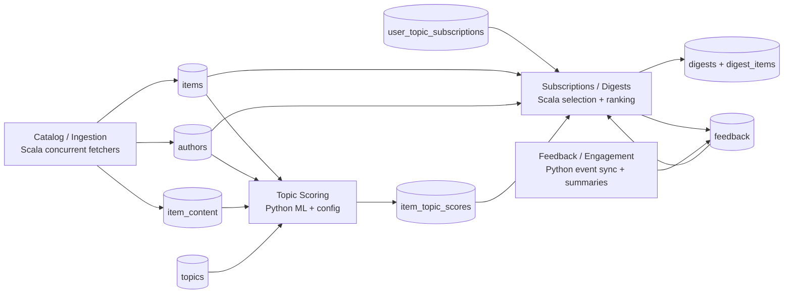

# knowledge-os

**Multi-source digest pipeline with semantic topic matching, engagement detection, and inline read tracking.**

Curates stories from Hacker News and Substack RSS feeds, matches them to persona interests via sentence-transformer embeddings, and delivers cadence-aware digest links via WhatsApp.

---

## How It Works

The canonical architecture is four independent modules connected by SQLite.



Current production uses the modular path: morning catalog ingest/render through `scripts/run_catalog_ingest.sh`, immediate remote website publish via the `bvaibhav-info` GitHub Action, and afternoon WhatsApp delivery from the existing rendered digest.

---

## Quick Start

```bash
# Install/update dependencies
uv pip install -e . -r requirements.txt --python venv/bin/python

# Install test dependencies
uv pip install -r requirements-dev.txt --python venv/bin/python

# Scala toolchain for ingestion
brew install openjdk sbt scala
export JAVA_HOME=/opt/homebrew/opt/openjdk
export PATH="$JAVA_HOME/bin:$PATH"

# Run the production morning ingest/render and push the digest artifact
bash scripts/run_catalog_ingest.sh

# Run ingest, watch the website publish workflow, and verify bvaibhav.info
bash scripts/run_daily_ingest_and_verify_publish.sh

# Send from the existing rendered digest artifact
bash scripts/daily_vb_whatsapp_digest.sh
bash scripts/weekly_kintu_whatsapp_digest.sh

# Run tests (integration tests require DB and are excluded in CI)
venv/bin/python -m pytest tests/ -v -m "not integration"
sbt test

# Initialize the target four-module schema
venv/bin/python -m knowledge_os.schema --db knowledge_os.db

# New modular commands
sbt "runMain knowledgeos.Ingest --db knowledge_os.db --sources config/sources.example.json --date $(date +%F)"
venv/bin/python -m knowledge_os.personas --db knowledge_os.db --catalog personas/catalog.json --users-dir configs/users
venv/bin/python -m knowledge_os.topic_scoring --db knowledge_os.db --config config/topic_scoring.example.json
venv/bin/python -m knowledge_os.persona_digest render --db knowledge_os.db --catalog personas/catalog.json --date "$(date +%F)" --overwrite

# Run the modular flow end to end
bash scripts/run_modular_digest.sh --db knowledge_os.db --date "$(date +%F)" --overwrite

# Backfill a historical HN submission date through Algolia instead of today's Firebase top stories
bash scripts/run_modular_digest.sh --db /tmp/knowledge_os.2026-02-12.db --date 2026-02-12 --historical-hn --overwrite

# Print a WhatsApp summary with persona-filtered website link
bash scripts/send_whatsapp_digest_prompt.sh --user kintu

# Dry-run WhatsApp delivery from the existing digest without site work
bash scripts/deliver_whatsapp_digest.sh --skip-digest --skip-site --dry-run

# Operational commands log progress to stderr, keeping JSON/stdout output parseable.

# Inspect modular pipeline state
bash scripts/query_catalog.sh
bash scripts/query_scoring.sh
bash scripts/query_subscriptions.sh --user vb
bash scripts/query_feedback.sh --user vb

# Browse items fetched today
bash scripts/query_fetched_items.sh --limit 50
bash scripts/query_fetched_items.sh --min-score 100 --topic "AI Research" --title agent
bash scripts/query_fetched_items.sh --source-api hackernews_algolia --date 2026-02-12

# Date filters for catalog/scoring queries
bash scripts/query_catalog.sh --since 2026-05-14 --until 2026-05-14
bash scripts/query_scoring.sh --topic AI/ML/LLMs --since 2026-05-14

```

---

## Delivery

Delivery is intentionally split into three steps:

1. Generate the website-facing digest and push the markdown artifact.
2. Trigger the remote `bvaibhav-info` GitHub Action so the website exports/builds from that artifact.
3. Send a short WhatsApp message that links to the persona-filtered website view.

The canonical digest artifact is:

```text
knos-digest/YYYY-MM-DD.md
```

The public read URL is:

```text
https://www.bvaibhav.info/knos-digest?personas=<comma-separated-persona-ids>
```

### Daily generation

Run the persona digest pipeline once per day on the delivery machine:

```bash
cd /Users/vb/dev/projects/knowledge-os

export JAVA_HOME=/opt/homebrew/opt/openjdk
export PATH="/opt/homebrew/opt/openjdk/bin:$PATH"

bash scripts/run_catalog_ingest.sh --date "$(date +%F)"
```

This performs catalog ingestion, persona materialization, topic scoring, combined digest rendering, a git push of `knos-digest/YYYY-MM-DD.md` when the artifact changed, and a `gh workflow run` dispatch for `centerfield1904/bvaibhav-info/update-digest.yml`. To run the same pipeline without committing/pushing or triggering the website workflow, call `scripts/run_modular_digest.sh` directly:

```bash
bash scripts/run_modular_digest.sh \
  --db knowledge_os.db \
  --date "$(date +%F)" \
  --overwrite
```

The `--date` is threaded into ingestion as `items.fetched_at` for audit/backfill runs and into rendering as the digest date. Persona selection uses source-aware cadence timestamps: Hacker News uses `items.fetched_at`; Substack/RSS uses `items.published_at`.

Persona cadence lives in `personas/catalog.json` under each persona's `selection` block:

```json
{
  "selection": {
    "cadence": "weekly",
    "send_days": ["fri"],
    "freshness_days": 7,
    "sources": ["hackernews", "substack"],
    "max_items": 8
  }
}
```

`daily` selects the one-day cadence window ending on the digest date. `weekly` selects the inclusive seven-day window ending on the digest date. `send_days` is optional; when present, that persona contributes only on those weekdays. `freshness_days` remains in the catalog for compatibility with the subscription table, but the canonical persona renderer uses `cadence` and source-aware item timestamps.

Cadence timestamp semantics are source-specific:

- Hacker News uses `items.fetched_at` for daily and weekly cadence eligibility. Ingestion sets this from `--date`, so backfill/audit runs should pass the logical source snapshot date rather than relying on wall-clock run time.
- Substack/RSS and other sources use `items.published_at`, because the feed entry publication timestamp is the source-native freshness signal.

The official HN Firebase API exposes near-real-time top/new/best story lists and item timestamps. It does not expose a date-addressable historical front-page endpoint, so historical HN page replay requires our own captured snapshots or another archival data source.

For historical HN backfills, pass `--historical-hn` with an explicit `--date`. This switches only the HN fetcher to Algolia `search_by_date` with a one-day `created_at_i` window and the configured minimum score; RSS/Substack fetching is unchanged.

```bash
bash scripts/run_modular_digest.sh \
  --db /tmp/knowledge_os.2026-02-12.db \
  --date 2026-02-12 \
  --historical-hn \
  --overwrite
```

Historical HN via Algolia approximates "stories submitted to HN on this date that currently satisfy the configured score filter." It is not an exact reconstruction of the HN front page or score/rank at that historical time.

The item row records the fetch provider in `items.source_api`:

- `hackernews_firebase` — normal current HN Firebase API ingest
- `hackernews_algolia` — historical HN Algolia ingest
- `rss` — RSS/Substack feed ingest

### Debugging persona selection

An empty user digest does not necessarily mean ingestion or scoring failed. The canonical digest is rendered first, then each user's configured personas filter that shared markdown. A user can have zero items when scored candidates were dropped by persona selection rules.

`knowledge_os.persona_digest` logs selection summaries to stderr by default. The summary includes scored row count, unknown topic rows, passed candidates, selected items, selected items by persona, and candidate drop reason counts.

Run a safe debug render to inspect the existing DB without changing the canonical `knos-digest/YYYY-MM-DD.md` file:

```bash
KNOS_PERSONA_DIGEST_LOG_LEVEL=DEBUG \
venv/bin/python -m knowledge_os.persona_digest render \
  --db knowledge_os.db \
  --catalog personas/catalog.json \
  --date "$(date +%F)" \
  --output /tmp/knos-digest-debug.md \
  --overwrite
```

Common drop reasons:

- `below_min_topic_score` — topic score is below the persona's `selection.min_topic_score`
- `source_not_allowed` — item source is not in the persona's `selection.sources`
- `send_day_mismatch` — persona has `selection.send_days`, and the digest date is not one of them
- `missing_fetched_at` — Hacker News item has no parseable fetch timestamp
- `missing_published_at` — item has no parseable publication timestamp
- `outside_cadence_window` — the source-aware cadence timestamp is outside the `daily` or `weekly` cadence window

Use fetched-item queries to separate scorer behavior from selector behavior:

```bash
bash scripts/query_fetched_items.sh --date "$(date +%F)" --limit 50
bash scripts/query_fetched_items.sh --date "$(date +%F)" --topic "AI/ML/LLMs" --min-topic-score 0.3
bash scripts/query_fetched_items.sh --date "$(date +%F)" --topic "Data Science" --min-score 50 --title agent
```

If `query_fetched_items.sh` shows scored rows but the debug render reports `outside_cadence_window`, the scorer worked and the item was filtered by source-aware cadence eligibility. For Hacker News, inspect `fetched_at`; for Substack/RSS, inspect `published_at`.

### Website publish

The scheduled publish path is remote. `scripts/run_catalog_ingest.sh` commits and pushes the latest `knos-digest/YYYY-MM-DD.md`, then triggers the `bvaibhav-info` GitHub Action with GitHub CLI. The wrapper writes a daily success marker under `~/Library/Application Support/knowledge-os/cron/` only after the digest push and workflow dispatch succeed.

For manual operations, use the monitored wrapper:

```bash
bash scripts/run_daily_ingest_and_verify_publish.sh
```

That command appends to `/Users/vb/Library/Logs/knowledge-os-ingest.log`, watches the triggered `bvaibhav-info` workflow run, and verifies that `https://www.bvaibhav.info/data/knos-digest.json` contains today's digest.

The 10:30 IST readiness check is:

```bash
bash scripts/check_daily_digest_ready.sh --alert-vb
```

Without `--alert-vb`, the readiness command only prints failures and exits non-zero. With `--alert-vb`, it sends VB one WhatsApp alert per day if the daily digest is not published by the check time. Manas and Mikey delivery wrappers also call this readiness check and fail closed before sending if the website is stale.

For manual local website verification only, run the export in the `bvaibhav-info` checkout:

```bash
cd /Users/vb/dev/projects/bvaibhav-info
npm run export-digest
npm run build
```

### WhatsApp delivery

Each user config in `configs/users/*.json` lists the personas that user subscribes to. The prompt command turns that into a personalized WhatsApp message and website URL:

```bash
cd /Users/vb/dev/projects/knowledge-os

bash scripts/send_whatsapp_digest_prompt.sh --user vb --date "$(date +%F)"
bash scripts/send_whatsapp_digest_prompt.sh --user kintu --date "$(date +%F)"
bash scripts/send_whatsapp_digest_prompt.sh --user mikey --date "$(date +%F)"
```

The prompt script prints message text only. The delivery wrapper can run the full delivery plan for manual use, but the scheduled path uses it in send-only mode after the morning job has generated and pushed the digest. Zero-item users receive a short focus message by default.

For scheduled delivery, prefer the split cron flow below: the 9 AM ingest job generates and pushes the digest artifact, and the 2 PM delivery job sends from that existing digest without regenerating or rebuilding anything.

Phone numbers stay in a local file outside git:

```json
{
  "vb": "+91XXXXXXXXXX",
  "kintu": "+91XXXXXXXXXX",
  "mikey": "+1XXXXXXXXXX"
}
```

Install the local WhatsApp Web sender dependencies and link the Baileys session once:

```bash
npm install
npm run whatsapp:login
```

The login command prints a QR code. Open WhatsApp on the sending phone, then use **Linked devices** → **Link a device**. Auth state is stored outside git at:

```text
~/.config/knowledge-os/baileys-auth
```

The Baileys session usually stays linked for weeks or months when used daily. You only need to log in again if WhatsApp unlinks the device, the auth directory is deleted/corrupted, or the health check prints a QR code:

```bash
node scripts/baileys_send.mjs --login-only --timeout-ms 30000
```

Expected healthy output:

```json
{"ok":true,"loginOnly":true,"sessionDir":"/Users/vb/.config/knowledge-os/baileys-auth"}
```

To confirm which WhatsApp account is linked without printing auth secrets:

```bash
node -e "const fs=require('fs'); const c=JSON.parse(fs.readFileSync(process.env.HOME+'/.config/knowledge-os/baileys-auth/creds.json','utf8')); console.log(JSON.stringify({me:c.me, registered:c.registered, platform:c.platform}, null, 2));"
```

Do not delete the full auth directory unless you want to relink. If sends become flaky, first clear only stale Signal session files and then run the health check:

```bash
rm ~/.config/knowledge-os/baileys-auth/session-*.json
node scripts/baileys_send.mjs --login-only --timeout-ms 30000
```

Dry run delivery without sending:

```bash
export JAVA_HOME=/opt/homebrew/opt/openjdk
export PATH="/opt/homebrew/opt/openjdk/bin:$PATH"

bash scripts/deliver_whatsapp_digest.sh \
  --date "$(date +%F)" \
  --recipients "$HOME/.config/knowledge-os/whatsapp-recipients.json" \
  --dry-run
```

Send through the linked Baileys WhatsApp Web session. For the scheduled 2 PM path, skip digest generation and site work:

```bash
bash scripts/deliver_whatsapp_digest.sh \
  --date "$(date +%F)" \
  --recipients "$HOME/.config/knowledge-os/whatsapp-recipients.json" \
  --skip-digest \
  --skip-site \
  --send
```

By default the wrapper calls `node scripts/baileys_send.mjs --to {phone} --message {message}`. If the local sender needs a different shape, use placeholders:

```bash
bash scripts/deliver_whatsapp_digest.sh \
  --send \
  --send-command "whatsapp-send --phone {phone} --text {message}"
```

Cron example for the delivery Mac:

```cron
CRON_TZ=Asia/Kolkata
SHELL=/bin/bash
PATH=/opt/homebrew/bin:/opt/homebrew/opt/openjdk/bin:/usr/local/bin:/usr/bin:/bin
JAVA_HOME=/opt/homebrew/opt/openjdk

0 9 * * * /Users/vb/dev/projects/knowledge-os/scripts/run_catalog_ingest.sh >> /Users/vb/Library/Logs/knowledge-os-ingest.log 2>&1
30 10 * * * /Users/vb/dev/projects/knowledge-os/scripts/check_daily_digest_ready.sh --alert-vb >> /Users/vb/Library/Logs/knowledge-os-delivery.log 2>&1
30 11 * * * /Users/vb/dev/projects/knowledge-os/scripts/daily_manas_whatsapp_digest.sh >> /Users/vb/Library/Logs/knowledge-os-delivery.log 2>&1
0 14 * * * /Users/vb/dev/projects/knowledge-os/scripts/daily_vb_whatsapp_digest.sh >> /Users/vb/Library/Logs/knowledge-os-delivery.log 2>&1
5 14 * * 5 /Users/vb/dev/projects/knowledge-os/scripts/weekly_kintu_whatsapp_digest.sh >> /Users/vb/Library/Logs/knowledge-os-delivery.log 2>&1
30 2,3 * * * /Users/vb/dev/projects/knowledge-os/scripts/daily_mikey_whatsapp_digest.sh >> /Users/vb/Library/Logs/knowledge-os-delivery.log 2>&1
```

In this split schedule, the 9 AM IST job calls `scripts/run_modular_digest.sh` to ingest catalog data and render `knos-digest/YYYY-MM-DD.md`, then triggers the remote website workflow. The 10:30 IST readiness job alerts VB if the website has not published the daily digest. Manas receives the link at 2 PM Singapore time (`11:30` under `Asia/Kolkata`). VB receives a daily digest at 2 PM IST; Kintu receives the weekly UX/design digest at 2:05 PM IST on Friday. Mikey's cron runs at the possible IST equivalents of 2 PM Pacific (`02:30` during daylight time, `03:30` during standard time), and `scripts/daily_mikey_whatsapp_digest.sh` exits unless the current Pacific time is exactly `14:00`.

The delivery wrapper serializes WhatsApp sends with a local lock under `~/Library/Application Support/knowledge-os/cron` so overlapping cron jobs do not open the same Baileys session concurrently.

The morning wrapper commits and pushes only the rendered `knos-digest/YYYY-MM-DD.md` artifact when it changes:

```bash
bash scripts/run_catalog_ingest.sh
bash scripts/run_catalog_ingest.sh --date 2026-05-28
```

The afternoon wrapper sends from the existing artifact and skips generation/site work:

```bash
bash scripts/daily_manas_whatsapp_digest.sh
bash scripts/daily_mikey_whatsapp_digest.sh
bash scripts/daily_vb_whatsapp_digest.sh
bash scripts/weekly_kintu_whatsapp_digest.sh
bash scripts/deliver_whatsapp_digest.sh --users vb --skip-digest --skip-site --send
```

If a user has zero matching digest items, delivery still sends a short focus message instead of skipping the user. Pass `--skip-empty` to `knowledge_os.whatsapp_delivery` only if you explicitly want zero-item users skipped.

The cron host must have:

- this repo checked out at `/Users/vb/dev/projects/knowledge-os`
- Python dependencies installed in `venv/`
- Node dependencies installed in this repo with `npm install`
- OpenJDK and SBT available. If using Apple Silicon Homebrew, install Java with `/opt/homebrew/bin/brew install openjdk`; if using Intel Homebrew, `brew install openjdk` installs under `/usr/local/opt/openjdk`.
- GitHub CLI installed and authenticated with repo access: `gh auth login -h github.com`
- Baileys WhatsApp Web session linked in `~/.config/knowledge-os/baileys-auth`

The website repo checkout and its Node dependencies are only needed if you manually run local website export/build. The scheduled publish path relies on the pushed digest artifact, authenticated `gh`, and the remote website GitHub Action.

Cron does not catch up missed jobs after the Mac wakes. Keep the host awake for the scheduled windows:

```bash
sudo pmset repeat wakeorpoweron MTWRFSU 08:55:00
```

Check the wake schedule:

```bash
pmset -g sched
```

Clear the repeating schedule if needed:

```bash
sudo pmset repeat cancel
```

Practical setup:

- Wake at `08:55`
- Ingest at `09:00`
- Delivery at `14:00`

Also disable aggressive sleep while plugged in:

```bash
sudo pmset -c sleep 0
```

---

## Current Code Summary

The current production path is modular:

1. `scripts/run_catalog_ingest.sh` runs the morning cron path and publishes only the rendered digest artifact when it changes.
2. `scripts/run_modular_digest.sh` initializes the schema, ingests catalog rows, materializes personas, scores topics, and renders `knos-digest/YYYY-MM-DD.md`.
3. `knowledgeos.Ingest` fetches current HN stories through Firebase by default, or a requested historical HN submission date through Algolia when `--historical-hn` is passed. RSS/Substack fetching is unchanged.
4. `src/knowledge_os/persona_digest.py` selects from precomputed scores using persona selection rules, source-aware cadence timestamps, optional send-day gates, and exclusive persona assignment, then renders one canonical persona-marked markdown file.
5. `scripts/daily_vb_whatsapp_digest.sh` and `scripts/weekly_kintu_whatsapp_digest.sh` send from the existing markdown artifact at 2 PM without regenerating the catalog or website.
6. The website export/build is handled by the remote `bvaibhav-info` GitHub Action after the digest artifact is pushed.

The main runtime modules are:

| Area | Current Files | Notes |
|------|---------------|-------|
| Catalog / Ingestion | `src/main/scala/knowledgeos/Ingest.scala` | Concurrent source fetching, URL dedupe, author upserts, `items.fetched_at`, `items.published_at`, and `items.source_api`. |
| Topic Scoring | `src/knowledge_os/topic_scoring.py` | Loads `all-MiniLM-L6-v2`, scores global topic definitions, and stores scores by scoring config. |
| Personas / Subscriptions | `src/knowledge_os/personas.py`, `personas/catalog.json`, `configs/users/*.json` | Materializes global topics and user persona subscriptions. |
| Persona Digest | `src/knowledge_os/persona_digest.py` | Selects/renders from scored rows using source-aware cadence, persona thresholds, source filters, send days, and exclusive assignment. |
| Delivery | `scripts/deliver_whatsapp_digest.sh`, `src/knowledge_os/whatsapp_delivery.py`, `scripts/baileys_send.mjs` | Sends WhatsApp website-link summaries through the local Baileys session; zero-item users receive a focus message by default. |
| Queries | `src/knowledge_os/query_pipeline.py`, `scripts/query_*.sh` | Operational DB summaries, including fetched-item filters by date, score, topic, title text, source, and `source_api`. |
| Storage | `src/knowledge_os/schema.py` | Modular schema initialization and migrations for the active SQLite database. |
| Output | `knos-digest/YYYY-MM-DD.md` | Canonical website-facing digest artifact; the morning wrapper commits and pushes it when it changes. |

Legacy/experimental scripts and the old v2 digest path have been removed from the active tree.

The modular path is intentionally split:

| Module | Owner | Purpose |
|--------|-------|---------|
| Catalog / Ingestion | Scala | Concurrent source fetching, `items.url` dedupe, author and content upserts. |
| Topic Scoring | Python | Configurable ML scoring, global topics, historical score sets by scoring config. |
| Personas / Subscriptions | Python | Resolve persona assignments into global topics and user subscriptions. |
| Digests / Rendering | Python | Persona-aware selection and markdown rendering from precomputed scores. |
| Feedback | Python | User-per-item feedback ingestion into the common `feedback` table. |

---

## Sources

| Source | Fetcher | Config Key | Marker |
|--------|---------|------------|--------|
| Hacker News | `knowledgeos.Ingest` via Firebase for current runs; Algolia for `--historical-hn` | `sources.hackernews` | (none) |
| Substack/RSS | `knowledgeos.Ingest` RSS adapter | `sources.substack.feeds` | 📰 |

Stories from all sources are normalized into the `items` table. `published_at` stores the source-native publication/submission timestamp, `fetched_at` stores the logical catalog snapshot date, and `source_api` records the concrete provider (`hackernews_firebase`, `hackernews_algolia`, or `rss`).

---

## Digest Format

The canonical artifact is persona-marked markdown that the website exports to JSON. Example:
```
🦅 *HN Digest* - Afternoon Energy Boost
_4 stories worth your attention_

*AI/ML/LLMs*
- [ ] Nano Banana 2: Google's latest AI image generation model
  ↑533 | karma: 14,821 | by davidbarker
  💬 This is a significant step forward in diffusion-based generation.
  🔗 https://news.ycombinator.com/item?id=47167858
  Notes:
- [ ] 📰 How to Sound Like an Expert in Any AI Bubble Debate
  ↑0 | karma: 3,204 | by Derek Thompson
  🔗 https://www.derekthompson.org/p/how-to-sound-like-an-expert-in-any
  Notes:

_Keep building. The frontier moves forward._
```

---

## Pipeline Components

### Catalog / Ingestion
- **`src/main/scala/knowledgeos/Ingest.scala`** — HN Firebase current ingest, HN Algolia historical ingest, RSS/Substack feeds, URL dedupe, author/content upserts.

### Topic Scoring
- **`src/knowledge_os/topic_scoring.py`** — sentence-transformer scoring for active global topics against catalog items.

### Storage (`src/knowledge_os/schema.py`)
- Target SQLite schema for catalog, scoring configs, persona subscriptions, digest membership, and feedback events.
- `items.published_at` tracks source-native publication/submission time; `items.fetched_at` stores the logical catalog snapshot date.
- `items.source_api` records the concrete ingestion API/provider, currently `hackernews_firebase`, `hackernews_algolia`, or `rss`.

### Delivery
- **`scripts/run_modular_digest.sh`** — canonical persona digest pipeline; passes `--date` into ingestion and rendering; writes `knos-digest/YYYY-MM-DD.md`
- **`scripts/run_modular_digest.sh --historical-hn`** — historical HN backfill mode; fetches HN submissions for `--date` through Algolia and marks rows with `items.source_api = 'hackernews_algolia'`
- **`scripts/run_catalog_ingest.sh`** — cron-safe morning wrapper around `scripts/run_modular_digest.sh --overwrite`; commits and pushes the rendered digest artifact when it changes, then triggers the website publish workflow
- **`scripts/run_daily_ingest_and_verify_publish.sh`** — manual ops wrapper that runs the morning path, watches the website GitHub Action, and verifies the public website JSON
- **`scripts/check_daily_digest_ready.sh`** — readiness guard used by the 10:30 alert and external delivery wrappers
- **`scripts/send_whatsapp_digest_prompt.sh`** — prints a WhatsApp-ready summary plus persona-filtered website link for one configured user
- **`scripts/deliver_whatsapp_digest.sh`** — delivery wrapper; can run full generation/site refresh manually, or send-only with `--skip-digest --skip-site`
- **`scripts/baileys_send.mjs`** — local Baileys WhatsApp Web sender used by the delivery wrapper
- **`src/knowledge_os/whatsapp_delivery.py`** — validates local recipient config, sends zero-item focus messages, and calls the configured sender command

---

## Modular Configuration

Production modular runs use separate config files by module:

- `config/sources.example.json` — ingestion sources, HN throttle/retry settings, RSS feeds, and source limits
- `config/topic_scoring.example.json` — active scoring config and model/content-field settings
- `personas/catalog.json` — persona topics, keywords, selection thresholds, cadence, send days, source filters, and max items
- `configs/users/*.json` — user identity, timezone, and subscribed persona IDs

`config/user.vb.example.json` was removed because user subscriptions now live under `configs/users/`.

## File Structure

```
knowledge-os/
├── build.sbt                    # Scala build for ingestion
├── pytest.ini                   # pytest marker definitions
│
├── config/
│   ├── sources.example.json         # Ingestion config, including HN throttle/retry settings
│   └── topic_scoring.example.json   # Topic scoring config
├── configs/
│   ├── base.json
│   └── users/{vb,kintu,mikey}.json  # Persona-driven user configs
├── personas/
│   └── catalog.json                 # Canonical persona topic catalog
│
├── src/main/scala/knowledgeos/      # Scala package
│   ├── Ingest.scala             # Catalog ingestion
│   ├── Db.scala                 # JDBC helpers
│   └── Args.scala               # Small CLI parser
│
├── src/knowledge_os/                # Python package
│   ├── schema.py                # Target four-module SQLite schema
│   ├── personas.py              # Persona topic/subscription materializer
│   ├── persona_digest.py        # Canonical persona digest renderer + WhatsApp summary
│   ├── whatsapp_delivery.py     # Recipient lookup + optional WhatsApp sender invocation
│   ├── topic_scoring.py         # Configurable ML topic scoring
│   ├── subscriptions.py         # User subscription config loader
│   ├── feedback_events.py       # Common feedback event ingestion
│   └── feedback_events.py       # Common feedback event ingestion
│
├── scripts/
│   ├── run_catalog_ingest.sh    # Cron-safe morning ingest/render + digest artifact push
│   ├── run_daily_ingest_and_verify_publish.sh # Run ingest, watch website publish, verify public JSON
│   ├── check_daily_digest_ready.sh # Website publish readiness guard and VB alert
│   ├── run_modular_digest.sh    # Canonical persona digest runner
│   ├── send_whatsapp_digest_prompt.sh # Website-link WhatsApp prompt
│   ├── deliver_whatsapp_digest.sh # End-to-end website + WhatsApp delivery wrapper
│   ├── daily_vb_whatsapp_digest.sh # Cron-safe daily VB delivery
│   ├── daily_manas_whatsapp_digest.sh # Cron-safe Manas delivery
│   ├── daily_mikey_whatsapp_digest.sh # Cron-safe Mikey delivery
│   ├── weekly_kintu_whatsapp_digest.sh # Cron-safe Friday Kintu delivery
│   ├── baileys_send.mjs         # Baileys WhatsApp Web sender
│   ├── query_catalog.sh         # Catalog items/authors summary
│   ├── query_fetched_items.sh   # Fetched-item browser with score/topic/title/source filters
│   ├── query_scoring.sh         # Topics, scoring configs, top scores
│   ├── query_subscriptions.sh   # Users and topic subscriptions
│   └── query_feedback.sh        # Feedback events
│
├── CI
│   └── .github/workflows/tests.yml  # GitHub Actions — unit tests on push/PR
│
├── Tests
│   ├── src/test/scala/knowledgeos/*Suite.scala # Scala unit + integration tests
│   ├── tests/test_target_schema.py       # target schema/config/feedback tests
│   ├── tests/test_persona_digest.py      # persona renderer tests
│   ├── tests/test_query_pipeline.py      # query CLI SQL tests
│   └── tests/test_whatsapp_delivery.py    # unit
│
├── Output
│   ├── knos-digest/YYYY-MM-DD.md    # generated persona digest markdown, pushed for website publish
│   └── archive/                     # generated raw story/digest archive
│
└── Docs
    ├── NEXT.md                  # Roadmap and decision log
    ├── CLAUDE.md                # AI assistant instructions
    └── ARCHITECTURE.md          # Schema and data flow reference
```

---

## Scheduling

```bash
# Generate, push, and trigger website publish: 9 AM IST daily
0 9 * * * /Users/vb/dev/projects/knowledge-os/scripts/run_catalog_ingest.sh

# Alert if the website has not published today's digest: 10:30 AM IST daily
30 10 * * * /Users/vb/dev/projects/knowledge-os/scripts/check_daily_digest_ready.sh --alert-vb

# Deliver Manas at 2 PM Singapore time, represented as 11:30 AM under Asia/Kolkata
30 11 * * * /Users/vb/dev/projects/knowledge-os/scripts/daily_manas_whatsapp_digest.sh

# Deliver VB daily from the existing digest: 2 PM IST daily
0 14 * * * /Users/vb/dev/projects/knowledge-os/scripts/daily_vb_whatsapp_digest.sh

# Deliver Kintu weekly from the existing digest: 2 PM IST Friday
5 14 * * 5 /Users/vb/dev/projects/knowledge-os/scripts/weekly_kintu_whatsapp_digest.sh

# Run at both possible IST equivalents; the wrapper sends only at 2 PM Pacific
30 2,3 * * * /Users/vb/dev/projects/knowledge-os/scripts/daily_mikey_whatsapp_digest.sh

```

---

## Tech Stack

- **Python 3.9+** with `venv/`
- **Scala 3** with `sbt` for concurrent catalog ingestion
- **OpenJDK** for the Scala toolchain
- **sentence-transformers** (`all-MiniLM-L6-v2`) for semantic matching
- **SQLite 3** for storage
- **HN Firebase API** for current story fetching
- **HN Algolia API** for explicit historical HN backfills
- **Baileys** for local WhatsApp Web delivery
- **pytest** for testing via `requirements-dev.txt` (`tmp_path` fixtures, `integration` marker)
- **munit** for Scala tests

---

## Recent Updates

**2026-05-27:** Persona cadence and date-aware ingestion
- Added persona-level `selection.cadence` and optional `selection.send_days`; daily uses the digest date, weekly uses the inclusive seven-day cadence window.
- Canonical persona selection now uses source-aware cadence timestamps: Hacker News uses `items.fetched_at`; Substack/RSS uses `items.published_at`.
- Scala ingestion accepts `--date YYYY-MM-DD` and stores that as `items.fetched_at` at UTC midnight for backfill/audit runs.
- `scripts/run_modular_digest.sh` and `scripts/run_catalog_ingest.sh` pass `--date` into Scala ingestion.
- Added `--historical-hn` for explicit HN backfills via Algolia `search_by_date`; item rows now record `items.source_api` for provider-aware filtering.

**2026-05-13:** Four-module architecture implementation slice
- Added target SQLite schema for catalog, separate content, global topics, historical topic scores, subscriptions, digest membership, and feedback events
- Added Scala project with concurrent catalog ingestion entry point
- Added Python modules for schema initialization, topic scoring, subscription loading, and feedback event sync
- Added unit and integration coverage for Scala ingestion and the four-module DB flow
- Verified `scala -version`, `sbt test`, and Python non-integration tests

**2026-04-30:** Empty digest fix + pipeline reliability
- `get_undelivered_item_ids` replaces `is_new` as the gate for what appears in the digest — a story is suppressed only after it has been delivered, not merely stored
- `--rerun` flag: clears today's archive files and removes stale `delivered` feedback from the last digest so the pipeline can re-run cleanly
- `--push` flag: git push is now opt-in (was always-on)

**2026-03-03:** published_at tracking, 52 Substack feeds, age filter
- All stories now carry `published_at` (ISO 8601); HN from `time` field, Substack from `updated_parsed` or `published_parsed`
- Legacy storage updates a re-fetched URL when the source reports a newer `published_at`; the canonical persona renderer now uses source-aware cadence timestamps
- `max_age_days` config setting (default 7) filters stories before matching — prevents old Substack backlog from flooding the digest
- 52 Substack feeds added from TSPC community CSV

**2026-02-27:** Multi-source support, inline read tracking, integration tests
- Substack RSS fetcher with config-driven feeds and 📰 source indicator
- Inline checkboxes + notes on every story and engagement item (removed separate Read Tracker section)
- Pipeline integration test (end-to-end with mocked externals)

**2026-02-20:** Engagement detection + digest archive
- 5 opportunities/day (Ask/Show HN, early threads, debates)
- Username tracking (vb7132) with auto comment sync
- `knos-digest/YYYY-MM-DD.md` archive format

**2026-02-13:** Storage v2 architecture
- SQLite backend with abstract interface
- Author tracking, digest history, feedback logging

**2026-02-11:** Initial launch
- Semantic topic matching, daily WhatsApp delivery

---

See [NEXT.md](NEXT.md) for the roadmap.

_Built with OpenClaw by Crow_
