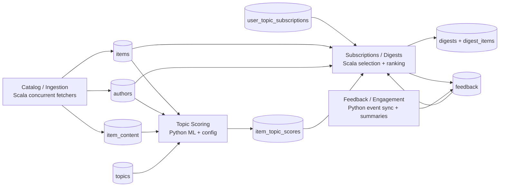

# knowledge-os

**Multi-source digest pipeline with semantic topic matching, engagement detection, and inline read tracking.**

Curates stories from Hacker News and Substack RSS feeds, matches them to persona interests via sentence-transformer embeddings, and delivers cadence-aware digest links via WhatsApp.

---

## How It Works

The architecture is moving from a single digest pipeline to four independent modules connected by SQLite.



Current production still supports `scripts/run_digest_v2.sh`; the new module commands are being added alongside it and are documented below.

---

## Quick Start

```bash
# Install/update dependencies
uv pip install -e . -r requirements.txt --python venv/bin/python

# Install test dependencies
uv pip install -r requirements-dev.txt --python venv/bin/python

# Scala toolchain for ingestion and digest selection/ranking
brew install openjdk sbt scala
export JAVA_HOME=/usr/local/opt/openjdk
export PATH="/usr/local/opt/openjdk/bin:$PATH"

# Run full digest pipeline
bash scripts/run_digest_v2.sh

# Fetch and store only (no digest generation — for 6-hour cron)
bash scripts/run_digest_v2.sh --fetch-only

# Re-run today's digest (clears archive files + stale delivered feedback)
bash scripts/run_digest_v2.sh --rerun

# Run and push digest to GitHub
bash scripts/run_digest_v2.sh --push

# Run tests (integration tests require DB and are excluded in CI)
venv/bin/python -m pytest tests/ -v -m "not integration"
sbt test

# Initialize the target four-module schema
venv/bin/python -m knowledge_os.schema --db knowledge_os.db

# New modular commands
sbt "runMain knowledgeos.Ingest --db knowledge_os.db --sources config/sources.example.json --date $(date +%F)"
venv/bin/python -m knowledge_os.personas --db knowledge_os.db --catalog personas/catalog.json --users-dir configs/users
venv/bin/python -m knowledge_os.topic_scoring --db knowledge_os.db --config config/topic_scoring.example.json
venv/bin/python -m knowledge_os.persona_digest render --db knowledge_os.db --catalog personas/catalog.json --date "$(date +%F)" --overwrite

# Run the modular flow end to end
bash scripts/run_modular_digest.sh --db knowledge_os.db --date "$(date +%F)" --overwrite

# Backfill a historical HN submission date through Algolia instead of today's Firebase top stories
bash scripts/run_modular_digest.sh --db /tmp/knowledge_os.2026-02-12.db --date 2026-02-12 --historical-hn --overwrite

# Print a WhatsApp summary with persona-filtered website link
bash scripts/send_whatsapp_digest_prompt.sh --user kintu

# Generate digest, refresh website data, and prepare WhatsApp delivery
bash scripts/deliver_whatsapp_digest.sh --dry-run

# Operational commands log progress to stderr, keeping JSON/stdout output parseable.

# Inspect modular pipeline state
bash scripts/query_catalog.sh
bash scripts/query_scoring.sh
bash scripts/query_subscriptions.sh --user vb
bash scripts/query_feedback.sh --user vb

# Browse items fetched today
bash scripts/query_fetched_items.sh --limit 50
bash scripts/query_fetched_items.sh --min-score 100 --topic "AI Research" --title agent
bash scripts/query_fetched_items.sh --source-api hackernews_algolia --date 2026-02-12

# Date filters for catalog/scoring queries
bash scripts/query_catalog.sh --since 2026-05-14 --until 2026-05-14
bash scripts/query_scoring.sh --topic AI/ML/LLMs --since 2026-05-14

# Sync read items from a digest file
venv/bin/python -m knowledge_os.sync_reading_log knos-digest/YYYY-MM-DD.md

# Weekly trending topics summary
venv/bin/python -m knowledge_os.weekly_summary

# Generate engagement summary
venv/bin/python -m knowledge_os.engagement_summary

# Run local dashboard
venv/bin/python -m streamlit run src/knowledge_os/dashboard.py
```

---

## Delivery

Delivery is intentionally split into three steps:

1. Generate and publish the website-facing digest.
2. Refresh the website digest export.
3. Send a short WhatsApp message that links to the persona-filtered website view.

The canonical digest artifact is:

```text
knos-digest/YYYY-MM-DD.md
```

The public read URL is:

```text
https://www.bvaibhav.info/knos-digest?personas=<comma-separated-persona-ids>
```

### Daily generation

Run the persona digest pipeline once per day on the delivery machine:

```bash
cd /Users/vb/.openclaw/workspace/knowledge-os

export JAVA_HOME=/opt/homebrew/opt/openjdk
export PATH="/opt/homebrew/opt/openjdk/bin:$PATH"

bash scripts/run_modular_digest.sh \
  --db knowledge_os.db \
  --date "$(date +%F)" \
  --overwrite
```

This performs catalog ingestion, persona materialization, topic scoring, and combined digest rendering.

The `--date` is threaded into ingestion as `items.fetched_at` for audit/backfill runs and into rendering as the digest date. Persona selection uses source-aware cadence timestamps: Hacker News uses `items.fetched_at`; Substack/RSS uses `items.published_at`.

Persona cadence lives in `personas/catalog.json` under each persona's `selection` block:

```json
{
  "selection": {
    "cadence": "weekly",
    "send_days": ["fri"],
    "freshness_days": 7,
    "sources": ["hackernews", "substack"],
    "max_items": 8
  }
}
```

`daily` selects the one-day cadence window ending on the digest date. `weekly` selects the inclusive seven-day window ending on the digest date. `send_days` is optional; when present, that persona contributes only on those weekdays. `freshness_days` remains in the catalog for compatibility with the subscription table, but the canonical persona renderer uses `cadence` and source-aware item timestamps.

Cadence timestamp semantics are source-specific:

- Hacker News uses `items.fetched_at` for daily and weekly cadence eligibility. Ingestion sets this from `--date`, so backfill/audit runs should pass the logical source snapshot date rather than relying on wall-clock run time.
- Substack/RSS and other sources use `items.published_at`, because the feed entry publication timestamp is the source-native freshness signal.

The official HN Firebase API exposes near-real-time top/new/best story lists and item timestamps. It does not expose a date-addressable historical front-page endpoint, so historical HN page replay requires our own captured snapshots or another archival data source.

For historical HN backfills, pass `--historical-hn` with an explicit `--date`. This switches only the HN fetcher to Algolia `search_by_date` with a one-day `created_at_i` window and the configured minimum score; RSS/Substack fetching is unchanged.

```bash
bash scripts/run_modular_digest.sh \
  --db /tmp/knowledge_os.2026-02-12.db \
  --date 2026-02-12 \
  --historical-hn \
  --overwrite
```

Historical HN via Algolia approximates "stories submitted to HN on this date that currently satisfy the configured score filter." It is not an exact reconstruction of the HN front page or score/rank at that historical time.

The item row records the fetch provider in `items.source_api`:

- `hackernews_firebase` — normal current HN Firebase API ingest
- `hackernews_algolia` — historical HN Algolia ingest
- `rss` — RSS/Substack feed ingest

### Debugging persona selection

An empty user digest does not necessarily mean ingestion or scoring failed. The canonical digest is rendered first, then each user's configured personas filter that shared markdown. A user can have zero items when scored candidates were dropped by persona selection rules.

`knowledge_os.persona_digest` logs selection summaries to stderr by default. The summary includes scored row count, unknown topic rows, passed candidates, selected items, selected items by persona, and candidate drop reason counts.

Run a safe debug render to inspect the existing DB without changing the canonical `knos-digest/YYYY-MM-DD.md` file:

```bash
KNOS_PERSONA_DIGEST_LOG_LEVEL=DEBUG \
venv/bin/python -m knowledge_os.persona_digest render \
  --db knowledge_os.db \
  --catalog personas/catalog.json \
  --date "$(date +%F)" \
  --output /tmp/knos-digest-debug.md \
  --overwrite
```

Common drop reasons:

- `below_min_topic_score` — topic score is below the persona's `selection.min_topic_score`
- `source_not_allowed` — item source is not in the persona's `selection.sources`
- `send_day_mismatch` — persona has `selection.send_days`, and the digest date is not one of them
- `missing_fetched_at` — Hacker News item has no parseable fetch timestamp
- `missing_published_at` — item has no parseable publication timestamp
- `outside_cadence_window` — the source-aware cadence timestamp is outside the `daily` or `weekly` cadence window

Use fetched-item queries to separate scorer behavior from selector behavior:

```bash
bash scripts/query_fetched_items.sh --date "$(date +%F)" --limit 50
bash scripts/query_fetched_items.sh --date "$(date +%F)" --topic "AI/ML/LLMs" --min-topic-score 0.3
bash scripts/query_fetched_items.sh --date "$(date +%F)" --topic "Data Science" --min-score 50 --title agent
```

If `query_fetched_items.sh` shows scored rows but the debug render reports `outside_cadence_window`, the scorer worked and the item was filtered by source-aware cadence eligibility. For Hacker News, inspect `fetched_at`; for Substack/RSS, inspect `published_at`.

### Website refresh

The website export reads `knos-digest/` and writes `public/data/knos-digest.json` in the `bvaibhav-info` repo:

```bash
cd /Users/vb/dev/projects/bvaibhav-info
npm run export-digest
npm run build
```

If the website is deployed from git, commit and push the refreshed website data from that repo after `npm run export-digest`.

### WhatsApp delivery

Each user config in `configs/users/*.json` lists the personas that user subscribes to. The prompt command turns that into a personalized WhatsApp message and website URL:

```bash
cd /Users/vb/.openclaw/workspace/knowledge-os

bash scripts/send_whatsapp_digest_prompt.sh --user vb --date "$(date +%F)"
bash scripts/send_whatsapp_digest_prompt.sh --user kintu --date "$(date +%F)"
bash scripts/send_whatsapp_digest_prompt.sh --user mikey --date "$(date +%F)"
```

The prompt script prints message text only. The delivery wrapper can run the full delivery plan for manual use, but the scheduled path uses it in send-only mode after the morning job has generated and pushed the digest. Zero-item users receive a short focus message by default.

For scheduled delivery, prefer the split cron flow below: the 9 AM ingest job generates and pushes the digest artifact, and the 2 PM delivery job sends from that existing digest without regenerating or rebuilding anything.

Phone numbers stay in a local file outside git:

```json
{
  "vb": "+91XXXXXXXXXX",
  "kintu": "+91XXXXXXXXXX",
  "mikey": "+1XXXXXXXXXX"
}
```

Install the local WhatsApp Web sender dependencies and link the Baileys session once:

```bash
npm install
npm run whatsapp:login
```

The login command prints a QR code. Open WhatsApp on the sending phone, then use **Linked devices** → **Link a device**. Auth state is stored outside git at:

```text
~/.config/knowledge-os/baileys-auth
```

The Baileys session usually stays linked for weeks or months when used daily. You only need to log in again if WhatsApp unlinks the device, the auth directory is deleted/corrupted, or the health check prints a QR code:

```bash
node scripts/baileys_send.mjs --login-only --timeout-ms 30000
```

Expected healthy output:

```json
{"ok":true,"loginOnly":true,"sessionDir":"/Users/vb/.config/knowledge-os/baileys-auth"}
```

To confirm which WhatsApp account is linked without printing auth secrets:

```bash
node -e "const fs=require('fs'); const c=JSON.parse(fs.readFileSync(process.env.HOME+'/.config/knowledge-os/baileys-auth/creds.json','utf8')); console.log(JSON.stringify({me:c.me, registered:c.registered, platform:c.platform}, null, 2));"
```

Do not delete the full auth directory unless you want to relink. If sends become flaky, first clear only stale Signal session files and then run the health check:

```bash
rm ~/.config/knowledge-os/baileys-auth/session-*.json
node scripts/baileys_send.mjs --login-only --timeout-ms 30000
```

Dry run delivery without sending:

```bash
export JAVA_HOME=/opt/homebrew/opt/openjdk
export PATH="/opt/homebrew/opt/openjdk/bin:$PATH"

bash scripts/deliver_whatsapp_digest.sh \
  --date "$(date +%F)" \
  --recipients "$HOME/.config/knowledge-os/whatsapp-recipients.json" \
  --dry-run
```

Send through the linked Baileys WhatsApp Web session. For the scheduled 2 PM path, skip digest generation and site work:

```bash
bash scripts/deliver_whatsapp_digest.sh \
  --date "$(date +%F)" \
  --recipients "$HOME/.config/knowledge-os/whatsapp-recipients.json" \
  --skip-digest \
  --skip-site \
  --send
```

By default the wrapper calls `node scripts/baileys_send.mjs --to {phone} --message {message}`. If the local sender needs a different shape, use placeholders:

```bash
bash scripts/deliver_whatsapp_digest.sh \
  --send \
  --send-command "whatsapp-send --phone {phone} --text {message}"
```

Cron example for the second Mac:

```cron
CRON_TZ=Asia/Kolkata
SHELL=/bin/bash
PATH=/opt/homebrew/bin:/opt/homebrew/opt/openjdk/bin:/usr/local/bin:/usr/bin:/bin
JAVA_HOME=/opt/homebrew/opt/openjdk

0 9 * * * /Users/vb/dev/projects/knowledge-os/scripts/run_catalog_ingest.sh >> /Users/vb/Library/Logs/knowledge-os-ingest.log 2>&1
0 14 * * * /Users/vb/dev/projects/knowledge-os/scripts/daily_vb_whatsapp_digest.sh >> /Users/vb/Library/Logs/knowledge-os-delivery.log 2>&1
0 14 * * 5 /Users/vb/dev/projects/knowledge-os/scripts/weekly_kintu_whatsapp_digest.sh >> /Users/vb/Library/Logs/knowledge-os-delivery.log 2>&1
```

In this split schedule, the 9 AM job calls `scripts/run_modular_digest.sh` to ingest catalog data and render `knos-digest/YYYY-MM-DD.md`. Website export/build runs in the remote GitHub Action after the rendered digest change is pushed. The 2 PM delivery jobs send WhatsApp messages from the existing rendered digest and do not regenerate the catalog or digest. VB receives a daily digest; Kintu receives the weekly UX/design digest on Friday, matching the `ux_design` persona cadence.

The morning wrapper commits and pushes only the rendered `knos-digest/YYYY-MM-DD.md` artifact when it changes:

```bash
bash scripts/run_catalog_ingest.sh
bash scripts/run_catalog_ingest.sh --date 2026-05-28
```

The afternoon wrapper sends from the existing artifact and skips generation/site work:

```bash
bash scripts/daily_vb_whatsapp_digest.sh
bash scripts/weekly_kintu_whatsapp_digest.sh
bash scripts/deliver_whatsapp_digest.sh --users vb --skip-digest --skip-site --send
```

If a user has zero matching digest items, delivery still sends a short focus message instead of skipping the user. Pass `--skip-empty` to `knowledge_os.whatsapp_delivery` only if you explicitly want zero-item users skipped.

The cron host must have:

- this repo checked out at `/Users/vb/dev/projects/knowledge-os`
- Python dependencies installed in `venv/`
- Node dependencies installed in this repo with `npm install`
- OpenJDK and SBT available. If using Apple Silicon Homebrew, install Java with `/opt/homebrew/bin/brew install openjdk`; if using Intel Homebrew, `brew install openjdk` installs under `/usr/local/opt/openjdk`.
- Baileys WhatsApp Web session linked in `~/.config/knowledge-os/baileys-auth`

The website repo checkout and its Node dependencies are only needed if you manually run local website export/build. The scheduled publish path relies on the pushed digest artifact and the remote website GitHub Action.

Cron does not catch up missed jobs after the Mac wakes. Keep the host awake for the scheduled windows:

```bash
sudo pmset repeat wakeorpoweron MTWRFSU 08:55:00
```

Check the wake schedule:

```bash
pmset -g sched
```

Clear the repeating schedule if needed:

```bash
sudo pmset repeat cancel
```

Practical setup:

- Wake at `08:55`
- Ingest at `09:00`
- Delivery at `14:00`

Also disable aggressive sleep while plugged in:

```bash
sudo pmset -c sleep 0
```

---

## Current Code Summary

The current production path remains `scripts/run_digest_v2.sh`:

1. `src/knowledge_os/fetch_stories.py` fetches Hacker News top stories.
2. `src/knowledge_os/fetch_substack.py` fetches configured Substack RSS feeds when `feedparser` is installed and the feed/source is due.
3. The shell script merges both outputs into `all_stories.json`.
4. `src/knowledge_os/process_digest.py` filters by age and source frequency, scores stories with `TopicMatcher`, stores item/topic/author/digest records in SQLite, enriches stories with HN comment summaries and author karma, detects engagement opportunities, and writes digest text.
5. `scripts/run_digest_v2.sh` writes `digest.txt`, archives raw stories under `archive/YYYY-MM-DD_stories.json`, archives the digest under `archive/YYYY-MM-DD_digest.txt`, and copies the markdown-ready digest to `knos-digest/YYYY-MM-DD.md`.

The main runtime modules are:

| Area | Current Files | Notes |
|------|---------------|-------|
| Fetching | `src/knowledge_os/fetch_stories.py`, `src/knowledge_os/fetch_substack.py` | HN is required; Substack depends on configured feeds and `feedparser`. |
| Matching | `src/knowledge_os/match_topics.py` | Loads `all-MiniLM-L6-v2`, computes topic embeddings, and attaches `matched_topic`, `topic_score`, and `all_topic_scores`. |
| Processing | `src/knowledge_os/process_digest.py`, `src/knowledge_os/digest_pipeline.py`, `src/knowledge_os/digest_formatter.py`, `src/knowledge_os/digest_filters.py` | CLI wrapper, orchestration, formatting, and filters are split. |
| Storage | `src/knowledge_os/storage_interface.py`, `src/knowledge_os/storage_sqlite.py` | SQLite is the implemented backend. Postgres is only a future interface target. |
| Engagement | `src/knowledge_os/engagement.py`, `src/knowledge_os/engagement_summary.py` | Detects Ask/Show HN, early threads, debates, syncs `vb7132` comments, and generates engagement reports. |
| Read tracking | `src/knowledge_os/sync_reading_log.py` | Parses checked digest items and records `read` / `read_with_note` feedback. |
| Dashboard | `src/knowledge_os/dashboard.py` | Streamlit observability/config UI. |
| Output | `digest.txt`, `archive/`, `knos-digest/` | Generated locally and ignored by git except for `knos-digest/README.md`. |

Legacy/experimental scripts were removed from the active tree:

- The broken v1 runner (`run_digest.sh`) and its wrapper (`send_digest.py`) are gone.
- The older WhatsApp feedback-button experiment files are gone.
- Historical engagement integration code/docs are gone.

For daily operation, prefer `scripts/run_digest_v2.sh` and the files under `knos-digest/`.

The new modular path is intentionally split:

| Module | Owner | Purpose |
|--------|-------|---------|
| Catalog / Ingestion | Scala | Concurrent source fetching, `items.url` dedupe, author and content upserts. |
| Topic Scoring | Python | Configurable ML scoring, global topics, historical score sets by scoring config. |
| Personas / Subscriptions | Python | Resolve persona assignments into global topics and user subscriptions. |
| Digests | Scala | User-specific selection and ranking from precomputed scores; each run creates a new `digest_id`. |
| Rendering / Feedback | Python | Markdown rendering from `digest_items`, user-per-item feedback ingestion, and engagement/read summaries. |

---

## Sources

| Source | Fetcher | Config Key | Marker |
|--------|---------|------------|--------|
| Hacker News | `src/knowledge_os/fetch_stories.py` (API) | `sources.hackernews` | (none) |
| Substack | `src/knowledge_os/fetch_substack.py` (RSS) | `sources.substack.feeds` | 📰 |

Stories from all sources share a uniform schema (`id`, `title`, `url`, `score`, `by`, `time`, `descendants`, `text`, `source`, `published_at`) and go through the same semantic matching pipeline.

---

## Digest Format

Each story and engagement opportunity has an inline checkbox for read tracking. Mark `[x]` and add notes directly below any item, then run `venv/bin/python -m knowledge_os.sync_reading_log knos-digest/YYYY-MM-DD.md` to record to the DB.

Weekday digest — topic-grouped:
```
🦅 *HN Digest* - Afternoon Energy Boost
_4 stories worth your attention_

*AI/ML/LLMs*
- [ ] Nano Banana 2: Google's latest AI image generation model
  ↑533 | karma: 14,821 | by davidbarker
  💬 This is a significant step forward in diffusion-based generation.
  🔗 https://news.ycombinator.com/item?id=47167858
  Notes:
- [ ] 📰 How to Sound Like an Expert in Any AI Bubble Debate
  ↑0 | karma: 3,204 | by Derek Thompson
  🔗 https://www.derekthompson.org/p/how-to-sound-like-an-expert-in-any
  Notes:

_Keep building. The frontier moves forward._
```

Weekend digest — engagement-sorted:
```
🌿 *Weekend Reads* — Sat, Mar 7
_2 top matches · 10 interesting reads_

── Best Matches ──────────────────────
- [ ] Story matching your topics above the weekend threshold
  ↑480 | karma: 9,102 | by author
  🔗 https://news.ycombinator.com/item?id=...
  Notes:

── Interesting Reads ─────────────────
- [ ] Global warming has accelerated significantly
  ↑1057 | karma: 4,211 | by morsch
  💬 The methodology section is worth reading carefully.
  🔗 https://news.ycombinator.com/item?id=47275088
  Notes:

_A quieter read for the weekend._
```

---

## Pipeline Components

### Fetching
- **`src/knowledge_os/fetch_stories.py`** — HN top stories API, concurrent requests, filters by score (default 50+)
- **`src/knowledge_os/fetch_substack.py`** — RSS feeds via `feedparser`, config-driven feed list, stable IDs from URL hash; feeds accept per-feed `frequency` overrides as `{"url": "...", "frequency": "weekly"}` dicts

### Matching (`src/knowledge_os/match_topics.py`)
- Sentence-transformer embeddings (`all-MiniLM-L6-v2`)
- Topics defined in `config.json` with keyword lists and weights
- Configurable similarity threshold (default 0.3)
- `score_all_stories()` — scores all fetched stories without threshold filtering (used by weekend mode for the Interesting Reads pool)

### Engagement Detection (`src/knowledge_os/engagement.py`)
- **Ask/Show HN** — explicit feedback requests (score 0.75+)
- **Early threads** — <10 comments, <6h old (score 0.55+)
- **Hot debates** — 50+ comments, active (score 0.45+)
- Comment analysis with question/debate scoring boosts
- Auto-syncs `vb7132`'s HN comments to track engagement
- `fetch_user_karma(username)` — fetches HN karma per author for digest display

### Storage (`src/knowledge_os/storage_sqlite.py`)
- SQLite via abstract `StorageInterface` (swappable to Postgres)
- Tables: `users`, `topics`, `items`, `item_topic_scores`, `authors`, `digests`, `feedback`, `engagement_opportunities`, `user_comments`, `engagement_stats`
- `items.published_at` (ISO 8601) tracks source-native publication/submission time. The canonical persona renderer uses source-aware cadence windows: Hacker News uses `fetched_at`; Substack/RSS uses `published_at`.
- `items.source_api` records the concrete ingestion API/provider, currently `hackernews_firebase`, `hackernews_algolia`, or `rss`.

### Read Tracking (`src/knowledge_os/sync_reading_log.py`)
- Parses checked `[x]` items from digest markdown files
- Collects multi-line notes below each item
- Strips emoji prefixes (📰, 💬, 🔥, 🎯) to match titles in DB
- Records `read` or `read_with_note` feedback

### Delivery
- **`scripts/run_modular_digest.sh`** — canonical persona digest pipeline; passes `--date` into ingestion and rendering; writes `knos-digest/YYYY-MM-DD.md`
- **`scripts/run_modular_digest.sh --historical-hn`** — historical HN backfill mode; fetches HN submissions for `--date` through Algolia and marks rows with `items.source_api = 'hackernews_algolia'`
- **`scripts/run_catalog_ingest.sh`** — cron-safe morning wrapper around `scripts/run_modular_digest.sh --overwrite`; commits and pushes the rendered digest artifact when it changes
- **`scripts/send_whatsapp_digest_prompt.sh`** — prints a WhatsApp-ready summary plus persona-filtered website link for one configured user
- **`scripts/deliver_whatsapp_digest.sh`** — delivery wrapper; can run full generation/site refresh manually, or send-only with `--skip-digest --skip-site`
- **`scripts/baileys_send.mjs`** — local Baileys WhatsApp Web sender used by the delivery wrapper
- **`src/knowledge_os/whatsapp_delivery.py`** — validates local recipient config, sends zero-item focus messages, and calls the configured sender command
- **`src/knowledge_os/engagement_summary.py`** — engagement reflection report

### Dashboard (`src/knowledge_os/dashboard.py`)
Local Streamlit app for visibility into pipeline state, config management, and ad-hoc queries.

```bash
venv/bin/python -m streamlit run src/knowledge_os/dashboard.py
```

Six tabs:
- **Overview** — item counts by source, digest history, items-by-topic bar chart, engagement stats
- **Browse** — browse all stored stories by publication date with topic, source, and date-range filters; card layout with direct links
- **Config** — edit topics (keywords, weights), sources (feeds, toggles), pipeline settings, weekend mode, and followed HN users; writes directly to `config.json`
- **Stories** — filter items by source, date, score, topic, and author; expandable topic scores per row
- **Authors** — sortable author table with topic affinity tags
- **Simulator** — paste a URL or text, run it through the topic matcher, preview how it would appear in a digest

---

## Configuration (`config.json`)

The `frequency` field on each source controls which days its stories surface in the digest. All sources are still fetched and stored daily for tracking — frequency only affects digest inclusion.

Valid values: `"daily"` (default), `"weekly"` (Mondays), `"biweekly"` (Mondays of even ISO weeks), `"monthly"` (1st of month), `"quarterly"` (Jan/Apr/Jul/Oct 1st), or a list like `["mon", "wed", "fri"]`.

Substack feeds also accept per-feed frequency overrides as objects:
```json
"feeds": [
  "https://derekthompson.substack.com/feed",
  { "url": "https://stateoverflow.substack.com/feed", "frequency": "weekly" }
]
```

Full config shape:
```json
{
  "sources": {
    "hackernews": { "enabled": true, "frequency": "daily" },
    "substack": {
      "enabled": true,
      "frequency": "daily",
      "feeds": ["https://derekthompson.substack.com/feed"],
      "max_items": 10
    }
  },
  "topics": [
    { "name": "AI/ML/LLMs", "keywords": ["..."], "weight": 1.0 }
  ],
  "storage": {
    "backend": "sqlite",
    "sqlite": { "db_path": "hn_digest_v2.db" }
  },
  "settings": {
    "max_stories": 30,
    "min_score": 50,
    "max_age_days": 7,
    "similarity_threshold": 0.3,
    "notable_author_threshold": 3,
    "followed_hn_users": ["pg", "dang"],
    "weekend_mode": {
      "enabled": true,
      "apply_on": ["sat", "sun"],
      "similarity_threshold": 0.45,
      "max_top_matches": 10,
      "interesting_reads_count": 10,
      "interesting_min_score": 100,
      "digest_title": "Weekend Reads"
    }
  }
}
```

---

## File Structure

```
knowledge-os/
├── config.json                  # Topics, sources, settings (gitignored)
├── config.example.json          # Template config
├── build.sbt                    # Scala build for ingestion
├── pytest.ini                   # pytest marker definitions
│
├── config/
│   ├── sources.example.json         # Ingestion config, including HN throttle/retry settings
│   ├── topic_scoring.example.json   # Topic scoring config
│   └── user.vb.example.json         # User subscription config
├── configs/
│   ├── base.json
│   └── users/{vb,kintu,mikey}.json  # Persona-driven user configs
├── personas/
│   └── catalog.json                 # Canonical persona topic catalog
│
├── src/main/scala/knowledgeos/      # Scala package
│   ├── Ingest.scala             # Catalog ingestion
│   ├── Db.scala                 # JDBC helpers
│   └── Args.scala               # Small CLI parser
│
├── src/knowledge_os/                # Python package
│   ├── fetch_stories.py         # HN API fetcher
│   ├── fetch_substack.py        # Substack RSS fetcher (per-feed frequency)
│   ├── match_topics.py          # Semantic topic matcher + score_all_stories()
│   ├── schema.py                # Target four-module SQLite schema
│   ├── personas.py              # Persona topic/subscription materializer
│   ├── persona_digest.py        # Canonical persona digest renderer + WhatsApp summary
│   ├── whatsapp_delivery.py     # Recipient lookup + optional WhatsApp sender invocation
│   ├── topic_scoring.py         # Configurable ML topic scoring
│   ├── subscriptions.py         # User subscription config loader
│   ├── feedback_events.py       # Common feedback event ingestion
│   ├── process_digest.py        # Legacy production CLI wrapper
│   ├── digest_pipeline.py       # Main orchestration
│   ├── digest_formatter.py      # Digest text rendering
│   ├── digest_filters.py        # Age/frequency/weekend filters
│   ├── engagement.py            # Engagement detection, comment tracking, karma fetch
│   ├── engagement_summary.py    # Engagement summary generator
│   ├── sync_reading_log.py      # Parse read items from digest markdown
│   ├── storage_interface.py     # Abstract storage interface
│   ├── storage_sqlite.py        # SQLite implementation
│   ├── weekly_summary.py        # Weekly trending topics report
│   └── dashboard.py             # Streamlit UI
│
├── scripts/
│   ├── run_modular_digest.sh    # Canonical persona digest runner
│   ├── send_whatsapp_digest_prompt.sh # Website-link WhatsApp prompt
│   ├── deliver_whatsapp_digest.sh # End-to-end website + WhatsApp delivery wrapper
│   ├── daily_vb_whatsapp_digest.sh # Cron-safe daily VB delivery
│   ├── baileys_send.mjs         # Baileys WhatsApp Web sender
│   ├── query_catalog.sh         # Catalog items/authors summary
│   ├── query_scoring.sh         # Topics, scoring configs, top scores
│   ├── query_subscriptions.sh   # Users and topic subscriptions
│   ├── query_feedback.sh        # Feedback events
│   ├── run_digest_v2.sh         # Full pipeline (--fetch-only for 6h cron)
│   ├── daily_digest.sh          # Cron wrapper (2 PM digest)
│   └── send_engagement_summary.sh
│
├── CI
│   └── .github/workflows/tests.yml  # GitHub Actions — unit tests on push/PR
│
├── Tests
│   ├── src/test/scala/knowledgeos/*Suite.scala # Scala unit + integration tests
│   ├── tests/test_target_schema.py       # target schema/config/feedback tests
│   ├── tests/test_persona_digest.py      # persona renderer tests
│   ├── tests/test_query_pipeline.py      # query CLI SQL tests
│   ├── tests/test_process_digest.py       # unit
│   ├── tests/test_storage.py              # unit
│   ├── tests/test_engagement.py           # unit
│   ├── tests/test_sync_reading_log.py     # unit
│   ├── tests/test_fetch_substack.py       # unit
│   └── tests/test_pipeline_integration.py # integration (marked, excluded from CI)
│
├── Output
│   ├── knos-digest/YYYY-MM-DD.md    # generated persona digest markdown (gitignored)
│   └── archive/                     # generated raw story/digest archive
│
└── Docs
    ├── NEXT.md                  # Roadmap and decision log
    ├── CLAUDE.md                # AI assistant instructions
    └── ARCHITECTURE.md          # Schema and data flow reference
```

---

## Scheduling

```bash
# Digest: 2 PM daily
0 14 * * * /Users/vb/.openclaw/workspace/knowledge-os/scripts/daily_digest.sh

# Fetch-only: every 6 hours (keeps DB fresh for weekend mode Interesting Reads)
0 */6 * * * bash /Users/vb/.openclaw/workspace/knowledge-os/scripts/run_digest_v2.sh --fetch-only

# Weekly summary: Monday 9 AM
0 9 * * 1 /Users/vb/.openclaw/workspace/knowledge-os/venv/bin/python -m knowledge_os.weekly_summary

# Engagement summary: 9 AM daily
0 9 * * * /Users/vb/.openclaw/workspace/knowledge-os/scripts/send_engagement_summary.sh
```

---

## Tech Stack

- **Python 3.9+** with `venv/`
- **Scala 3** with `sbt` for concurrent ingestion and digest selection/ranking
- **OpenJDK** for the Scala toolchain
- **sentence-transformers** (`all-MiniLM-L6-v2`) for semantic matching
- **feedparser** for Substack RSS
- **SQLite 3** for storage
- **HN Firebase API** for current story fetching
- **HN Algolia API** for explicit historical HN backfills
- **Baileys** for local WhatsApp Web delivery
- **pytest** for testing via `requirements-dev.txt` (`tmp_path` fixtures, `integration` marker)
- **munit** for Scala tests

---

## Recent Updates

**2026-05-27:** Persona cadence and date-aware ingestion
- Added persona-level `selection.cadence` and optional `selection.send_days`; daily uses the digest date, weekly uses the inclusive seven-day cadence window.
- Canonical persona selection now uses source-aware cadence timestamps: Hacker News uses `items.fetched_at`; Substack/RSS uses `items.published_at`.
- Scala ingestion accepts `--date YYYY-MM-DD` and stores that as `items.fetched_at` at UTC midnight for backfill/audit runs.
- `scripts/run_modular_digest.sh` and `scripts/run_catalog_ingest.sh` pass `--date` into Scala ingestion.
- Added `--historical-hn` for explicit HN backfills via Algolia `search_by_date`; item rows now record `items.source_api` for provider-aware filtering.

**2026-05-13:** Four-module architecture implementation slice
- Added target SQLite schema for catalog, separate content, global topics, historical topic scores, subscriptions, digest membership, and feedback events
- Added Scala project with concurrent ingestion and digest selection/ranking entry points
- Added Python modules for schema initialization, topic scoring, subscription loading, and feedback event sync
- Added unit and integration coverage for Scala selection/ranking and the four-module DB flow
- Verified `scala -version`, `sbt test`, and Python non-integration tests

**2026-04-30:** Empty digest fix + pipeline reliability
- `get_undelivered_item_ids` replaces `is_new` as the gate for what appears in the digest — a story is suppressed only after it has been delivered, not merely stored
- `--rerun` flag: clears today's archive files and removes stale `delivered` feedback from the last digest so the pipeline can re-run cleanly
- `--push` flag: git push is now opt-in (was always-on)

**2026-03-07:** Weekend mode, karma display, followed users, CI, weekly summary
- **Weekend mode** — Saturday/Sunday digest splits into "Best Matches" (stricter threshold) and "Interesting Reads" (high-HN-score stories regardless of topic); fully configurable via dashboard Config tab
- **Digest format** — comment count replaced with author HN karma (`karma: N`); top comment's first sentence shown as 💬 blurb instead of keyword extraction
- **Followed HN users** — `followed_hn_users` config list; followed users get ⭐ in digest regardless of story count; add/remove via dashboard
- **Per-feed Substack frequency** — individual feeds can override the source-level frequency with `{"url": "...", "frequency": "weekly"}`
- **Weekly summary** — `src/knowledge_os/weekly_summary.py` reports last 7 days of matched stories by topic
- **GitHub Actions CI** — `.github/workflows/tests.yml` runs unit tests on push/PR; integration tests marked and excluded
- **`scripts/run_digest_v2.sh --fetch-only`** — fetches and stores without generating a digest (for 6-hour cron)

**2026-03-03:** published_at tracking, 52 Substack feeds, Browse tab, age filter
- All stories now carry `published_at` (ISO 8601); HN from `time` field, Substack from `updated_parsed` or `published_parsed`
- Legacy storage updates a re-fetched URL when the source reports a newer `published_at`; the canonical persona renderer now uses source-aware cadence timestamps
- `max_age_days` config setting (default 7) filters stories before matching — prevents old Substack backlog from flooding the digest
- 52 Substack feeds added from TSPC community CSV
- Dashboard **Browse** tab: card-based reading view, filter by topic/source/date range, grouped by publication date

**2026-02-27:** Multi-source support, inline read tracking, integration tests
- Substack RSS fetcher with config-driven feeds and 📰 source indicator
- Inline checkboxes + notes on every story and engagement item (removed separate Read Tracker section)
- Pipeline integration test (end-to-end with mocked externals)
- Fixed `scripts/run_digest_v2.sh` to use `venv/bin/python`

**2026-02-20:** Engagement detection + digest archive
- 5 opportunities/day (Ask/Show HN, early threads, debates)
- Username tracking (vb7132) with auto comment sync
- `knos-digest/YYYY-MM-DD.md` archive format

**2026-02-13:** Storage v2 architecture
- SQLite backend with abstract interface
- Author tracking, digest history, feedback logging

**2026-02-11:** Initial launch
- Semantic topic matching, daily WhatsApp delivery

---

See [NEXT.md](NEXT.md) for the roadmap.

_Built with OpenClaw by Crow_
